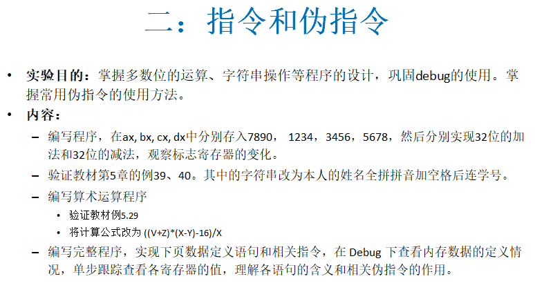
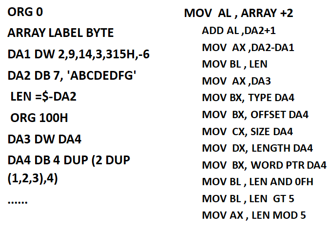
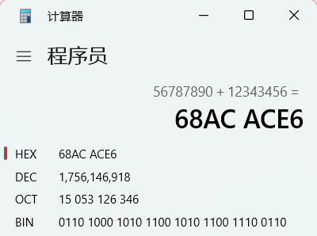
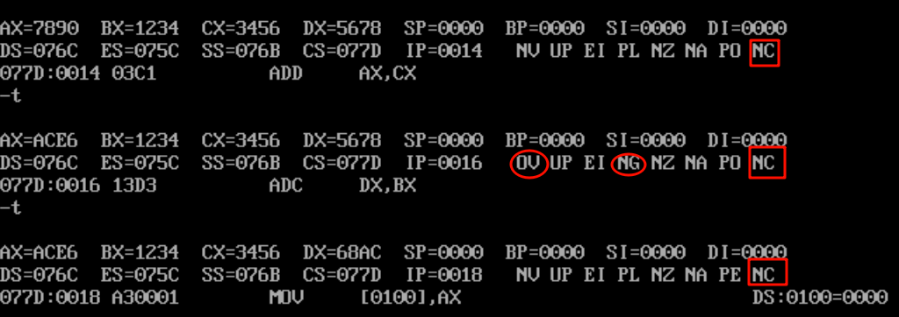
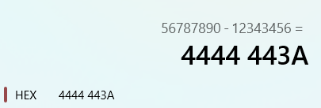
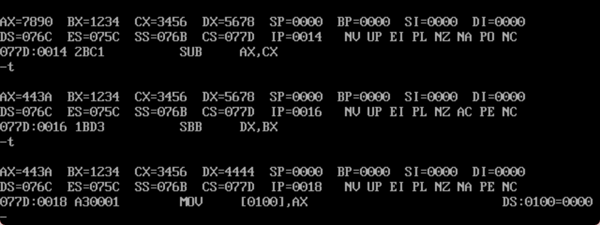
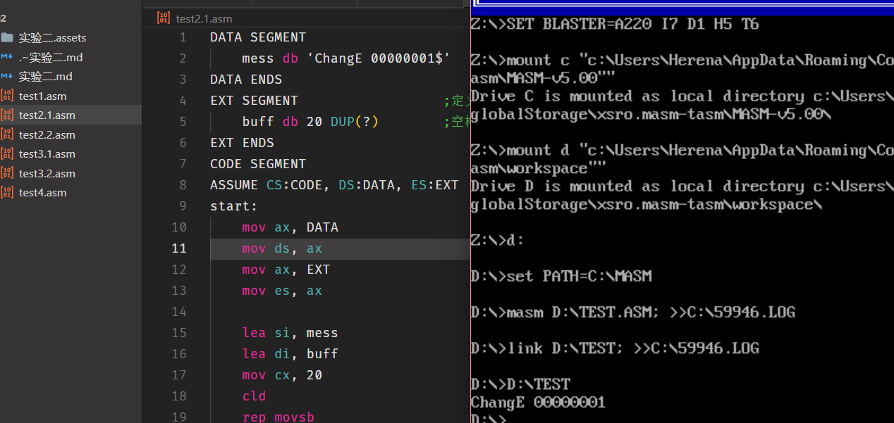
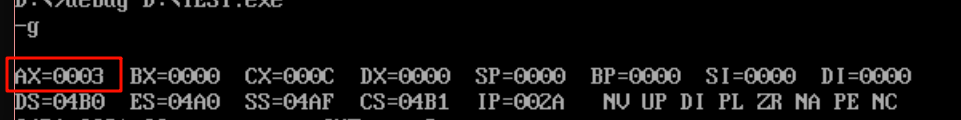
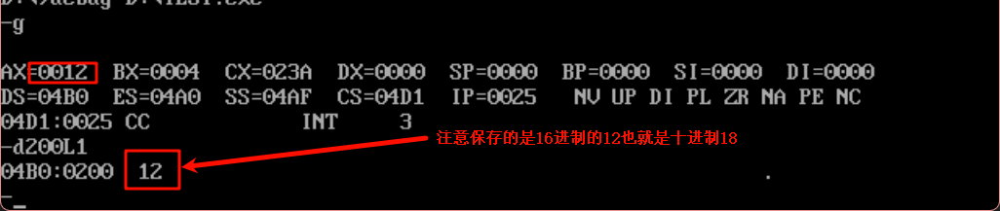

# 1.test1

编写程序，在ax,bx,cx,dx中分别存入7890h,1234h,3456h,5678h,然后分别实现32位的加法和32位的减法，观察标志寄存器的变化。

先考虑加法：

①8086普通加减法最多只能支持十六位，因此需要扩展，所以可以将32位拆分高低两个字节

则可以设置

```
数字A=[dx][ax]=56787890h
数字B=[bx][cx]=12343456h
```

```asm
ADD AX,CX 		;低16位相加
ADC DX,BX 		;高16位相加
```

①首先低字节相加是不用考虑溢出的，因为可以进位给高字节处理

②高字节则要考虑进位，所以要用ADC,那么DX=DX+BX+CF。

③如果说高字节发生溢出怎么办？这时只能在扩展了，8086一共有8个通用寄存器，理论上最多能处理16×8÷2=64位的加减法。





④结果分析：可看到进位标志一直CF=NC(0)，因为CF是无符号数溢出标志，所以都没有溢出，结果正确;也可以看到在执行ADD AX,CX 后溢出标志(OF)和符号标志(SF)都改变了，那是因为OF作为有符号数的溢出标志，两个正数相加变成了负数(SF=NG(1))，所以用(OF=OV(1))表示溢出，则结果是错误的。

如果是减法，也是一样的：



```
SUB AX,CX	;低位字相减
SBB DX,BX	;高位字相减
```



# 2.test2

验证教材第5章的例39、40。其中的字符串改为本人的姓名全拼拼音加空格后连学号。

例39：数据段中有一个字符串MESS，长度为19，要求把他们传送到附加段中名为BUFF的缓冲区中，并显示BUFF字符串。

①其实这种简单的字符显示直接调用09HDos功能就行，不过这种简单的事情复杂做是为了了解`REP MOVSB`的使用，其中的原理是MOVSB每次复制一个字节到缓冲区，把$当作结束标识。

```asm
DATA SEGMENT
	mess db 'ChangE 00000001$'
DATA ENDS
EXT SEGMENT                  ;定义额外段存放目标串
	buff db 20 DUP(?)        ;空格和美元符号$都占一个字节
EXT ENDS
CODE SEGMENT
ASSUME CS:CODE, DS:DATA, ES:EXT
start:
	mov ax, DATA                 ;赋地址段
	mov ds, ax
	mov ax, EXT                  ;赋段地址
	mov es, ax
	
	lea si, mess                 ;赋偏移地址
	lea di, buff
	mov cx, 20                   ;串长
	cld                          ;设置DF的方向
	rep movsb                    ;完成串传送
	mov bx, es                   ;准备显示buff字符串
	mov ds, bx                   ;ds:dx指向待显示串的地址
	lea dx, buff
	mov ah, 09h
	int 21h
	mov ah, 4ch
	int 21h
CODE ENDS
END start
```



例40：在数据段中有一个长度为19的字符串MESS1，和另一个字符串mess2，比较它们是否相等，相等打印“Y”，不相等打印“N”

②类似的`repe cmpsb`也是通过重复字节的比较来实现字符串比较

```asm
DATA SEGMENT
	mess1 db 'ChangE 00000001$'
	mess2 db 'HouYi 00000001$'
DATA ENDS
CODE SEGMENT
ASSUME CS:CODE, DS:DATA
start:
	mov ax, DATA                 ; 把数据段地址加载到AX
	mov ds, ax                   ; DS指向数据段（数据段寄存器）
	mov es, ax                   ; ES指向数据段（额外段寄存器）
	
    lea si, mess1                ; SI指向第一个字符串的起始地址
	lea di, mess2                ; DI指向第二个字符串的起始地址
	
	mov cx, 20                   ; 设置比较字节数为20
	cld                          ; 清除方向标志（正向比较，地址递增）
	
    repe cmpsb                   ; 重复比较字节
	                             ; repe = repeat while equal
	                             ; cmpsb = compare string byte
	                             ; 作用：比较DS:[SI]和ES:[DI]的内容
	                             ; 如果相等则继续，不相等则停止
	
	
	jz YES                       ; 如果ZF标志=1（相等），跳转到YES
	mov dl, 'N'                  ; 否则设置DL='N'（不相等）
	jmp DISP
YES:
	mov dl, 'Y'                  ; 相等则设置DL='Y'
DISP:
	mov ah, 02h                  ; 02号功能：显示单个字符
    int 21h                      ; 显示DL中的字符

	mov ah, 4ch
	int 21h
CODE ENDS
END start
```


③不过说到底，这里的分支条件判断是要自己先了解些才能看懂的。

# 3.test3

- 编写算术运算程序

   验证教材例5.29：计算表达式：(V-(X*Y+Z-16))/X，其中：X=4, Y=2, Z=14H(20), V=18H(24)，最终结果：AX = 3

  ①从数学规律上讲：`n位 × n位 = 最多 2n位`，所以乘法结果位数是两乘数之和，除法中除数与结果的位数和是被除数位数，所以进行乘除法前，都要CWD扩展位数，不然结果就会错误。

```asm
;计算表达式：(V-(X*Y+Z-16))/X
;其中：X=4, Y=2, Z=14H(20), V=18H(24)
;最终结果：AX = 3

DATA SEGMENT
    X DW 4          ;X = 4
    Y DW 2          ;Y = 2
    Z DW 14H        ;Z = 20（16进制14H）
    V DW 18H        ;V = 24（16进制18H）
DATA ENDS

CODE SEGMENT
    ASSUME CS:CODE, DS:DATA
    
START:
    ;初始化数据段
    MOV AX, DATA
    MOV DS, AX
    
    ;========== 第1步：计算 X*Y ==========
    MOV AX, X       ;AX = 4
    IMUL Y          ;DX:AX = 4*2 = 8，即 DX=0, AX=8（有符号乘法，结果在DX:AX）
    MOV CX, AX      ;CX = 8（保存低16位）
    MOV BX, DX      ;BX = 0（保存高16位）
    ;现在 BX:CX = 8（32位结果，高位在BX，低位在CX）
    
    ;========== 第2步：加上 Z ==========
    MOV AX, Z       ;AX = 20
    CWD             ;将AX扩展为32位（DX:AX），DX自动为0
    ADD CX, AX      ;CX = 8 + 20 = 28（低16位加法）
    ADC BX, DX      ;BX = 0 + 0 = 0（带进位的高16位加法）
    ;现在 BX:CX = 28，即 X*Y+Z = 28
    
    ;========== 第3步：减去 16 ==========
    SUB CX, 16      ;CX = 28 - 16 = 12（低16位减法）
    SBB BX, 0       ;BX = 0 - 0 = 0（带借位的高16位减法）
    ;现在 BX:CX = 12，即 X*Y+Z-16 = 12
    
    ;========== 第4步：计算 V - (X*Y+Z-16) ==========
    MOV AX, V       ;AX = 24
    CWD             ;DX:AX = 24（扩展为32位）
    SUB AX, CX      ;AX = 24 - 12 = 12（低16位减法）
    SBB DX, BX      ;DX = 0 - 0 = 0（带借位的高16位减法）
    ;现在 DX:AX = 12，即 V-(X*Y+Z-16) = 12
    
    ;========== 第5步：除以 X ==========
    IDIV X          ;DX:AX / X = 12 / 4
                    ;商在 AX = 3
                    ;余数在 DX = 0
    ;最终结果：AX = 3
    
    ;程序结束
    MOV AH, 4CH     ;DOS退出功能号
    INT 21H         ;调用DOS中断退出
    
CODE ENDS
END START
```

​	

- 将计算公式改为(V+Z)*(X-Y)-16/X：计算表达式：((V+Z)*(X-Y)-16)/X，其中：X=4, Y=2, Z=14H(20), V=18H(24)，最终结果：RESULT = 18

```asm
;计算表达式：((V+Z)*(X-Y)-16)/X
;其中：X=4, Y=2, Z=14H(20), V=18H(24)
;计算过程：
;  V+Z = 24+20 = 44
;  X-Y = 4-2 = 2
;  44*2 = 88
;  88-16 = 72
;  72/4 = 18
;最终结果：RESULT = 18

DATA SEGMENT
    X DW 4           ;X = 4
    Y DW 2           ;Y = 2
    Z DW 14H         ;Z = 20（16进制）
    V DW 18H         ;V = 24（16进制）
    RESULT DW ?      ;用于存储计算结果
DATA ENDS

CODE SEGMENT
    ASSUME CS:CODE, DS:DATA
    
START:
    ;初始化数据段
    MOV AX, DATA
    MOV DS, AX
    
    ;========== 第1步：计算 V+Z ==========
    MOV AX, V        ;AX = V (24)
    ADD AX, Z        ;AX = V + Z (24 + 20 = 44)
    ;现在 AX = 44
    
    ;========== 第2步：计算 X-Y ==========
    MOV BX, X        ;BX = X (4)
    SUB BX, Y        ;BX = X - Y (4 - 2 = 2)
    ;现在 BX = 2
    
    ;========== 第3步：计算 (V+Z)*(X-Y) ==========
    MUL BX           ;DX:AX = AX * BX = 44 * 2 = 88
                     ;注意：MUL 使用 AX 和 BX，结果在 DX:AX
                     ;DX = 0（高32位）, AX = 88（低32位）
    ;现在 DX:AX = 88
    
    ;========== 第4步：计算 (V+Z)*(X-Y)-16 ==========
    SUB AX, 16       ;AX = 88 - 16 = 72（低32位减法）
    SBB DX, 0        ;DX = 0 - 0 = 0（带借位的高32位减法，处理借位情况）
    ;现在 DX:AX = 72
    
    ;========== 第5步：计算 ((V+Z)*(X-Y)-16)/X ==========
    MOV BX, X        ;BX = 4（除数）
    DIV BX           ;DX:AX / BX
                     ;商存在 AX (72/4 = 18)
                     ;余数存在 DX (72%4 = 0)
    
    ;========== 第6步：存储结果 ==========
    MOV RESULT, AX   ;RESULT = 18（保存商到结果变量）
    
    ;程序结束
    MOV AH, 4CH      ;DOS程序结束功能号
    INT 21H          ;调用DOS中断退出

CODE ENDS
END START
```



②从结果结果上看，题目要求其实只是把数学式子翻译成汇编语言，考察的是基本的代码能力。

# 4. test4

编写完整程序，实现下页数据定义语句和相关指令，在Debug下查看内存数据的定义情况，单步跟踪查看各寄存器的值，理解各语句的含义和相关伪指令的作用。

①录入程序一步步调试就行了

```asm
;演示汇编中的数据定义、地址计算和各种操作符

DATA SEGMENT
    ;========== ORG 指令：设置起始地址 ==========
    ORG 0               ;从地址0开始定义数据
    
    ARRAY LABEL BYTE    ;定义一个字节数组的标签（ARRAY指向地址0）
    
    ;========== 定义数组DA1 ==========
    DA1 DW 2,9,14,3,315H,-6   ;定义6个字（16位），共12个字节
                               ;地址：0-1: 2, 2-3: 9, 4-5: 14, 6-7: 3, 8-9: 315H, 10-11: -6
    
    ;========== 定义数组DA2 ==========
    DA2 DB 7,"ABCDEFG"        ;定义1个字节(7) + 7个字符，共8个字节
                               ;地址：12: 7, 13-19: A,B,C,D,E,F,G
    
    ;========== 计算DA2的长度 ==========
    LEN = $-DA2                ;$表示当前位置（地址20）
                               ;LEN = 20 - 12 = 8（DA2的字节数）
    
    ;========== ORG 100H：跳到地址100H ==========
    ORG 100H            ;之后的数据从地址100H开始定义（跳过空隙）
    
    ;========== 定义DA3和DA4 ==========
    DA3 DW DA4          ;DA3存储DA4的地址
    
    DA4 DB 4 DUP(2 DUP(1,2,3),4)
                        ;4 DUP() 表示重复4次
                        ;每次重复：2 DUP(1,2,3) 表示 1,2,3 重复2次，再加一个 4
                        ;展开为：1,2,3,1,2,3,4, 1,2,3,1,2,3,4, 1,2,3,1,2,3,4, 1,2,3,1,2,3,4
                        ;共 4 × 7 = 28 个字节
    
DATA ENDS

CODE SEGMENT
    ASSUME CS:CODE, DS:DATA
    
START:
    MOV AX, DATA
    MOV DS, AX
    
    ;========== 地址寻址 ==========
    MOV AL, ARRAY+2         ;AL = ARRAY地址+2字节处的数据
                            ;= 地址2处的数据 = 9（DA1的第二个字的低字节）
    
    ADD AL, DA2+1           ;AL += DA2地址+1字节处的数据
                            ;= AL + 地址13处的数据 = AL + 'B'(42H)
    
    ;========== 地址差计算 ==========
    MOV AX, DA2-DA1         ;AX = DA2地址 - DA1地址
                            ;= 12 - 0 = 12（从DA1到DA2相隔12个字节）
    
    ;========== 符号的长度 ==========
    MOV BL, LEN             ;BL = 8（之前定义的LEN = 8）
    
    ;========== 取地址值 ==========
    MOV AX, DA3             ;AX = DA3中存储的值（DA4的地址）
                            ;= 100H（DA4在地址100H）
    
    ;========== TYPE操作符：返回元素大小 ==========
    MOV BX, TYPE DA4        ;BX = DA4的类型大小
                            ;= 1（因为DA4定义为 DB，每个元素1字节）
    
    ;========== OFFSET操作符：返回偏移地址 ==========
    MOV BX, OFFSET DA4      ;BX = DA4的偏移地址
                            ;= 100H（相对于数据段的偏移）
    
    ;========== SIZE操作符：返回总字节数 ==========
    MOV CX, SIZE DA4        ;CX = DA4占用的总字节数
                            ;= 28（4 × 7 = 28个字节）
    
    ;========== LENGTH操作符：返回元素个数 ==========
    MOV DX, LENGTH DA4      ;DX = DA4的元素个数
                            ;= 28（共28个字节元素）
    
    ;========== WORD PTR：指定操作大小 ==========
    MOV BX, WORD PTR DA4    ;将DA4的前2个字节作为字(16位)读入
                            ;= 0201H（因为DA4前两个字节是1,2）
    
    ;========== 逻辑运算符：AND ==========
    MOV BL, LEN AND 0FH     ;BL = 8 AND 0FH = 8（取低4位）
                            ;= 00001000 AND 00001111 = 00001000 = 8
    
    ;========== 比较运算符：GT（大于）==========
    MOV BL, LEN GT 5        ;BL = (LEN > 5) ? 1 : 0
                            ;= (8 > 5) = TRUE = 1（非零值表示真）
                            ;如果是 LEN LT 5 则返回0
    
    ;========== 算术运算符：MOD（取模）==========
    MOV BL, LEN MOD 5       ;BL = 8 MOD 5（8除以5的余数）
                            ;= 3
    
    ;程序结束
    MOV AH, 4CH
    INT 21H

CODE ENDS
END START
```

| 操作符/指令  | 作用             | 例子                     |
| ------------ | ---------------- | ------------------------ |
| `ORG`        | 设置数据起始地址 | `ORG 100H`               |
| `LABEL`      | 定义标签         | `ARRAY LABEL BYTE`       |
| `$`          | 当前位置         | `LEN = $-DA2` 计算长度   |
| `OFFSET`     | 返回偏移地址     | `OFFSET DA4`             |
| `TYPE`       | 返回元素大小     | `TYPE DA4`（DB=1字节）   |
| `SIZE`       | 返回总字节数     | `SIZE DA4`（28字节）     |
| `LENGTH`     | 返回元素个数     | `LENGTH DA4`（28个元素） |
| `WORD PTR`   | 指定16位操作     | `WORD PTR DA4`           |
| `AND/OR/XOR` | 位逻辑运算       | `LEN AND 0FH`            |
| `GT/LT/EQ`   | 比较运算         | `LEN GT 5` 返回1或0      |
| `MOD`        | 取模运算         | `LEN MOD 5`              |

