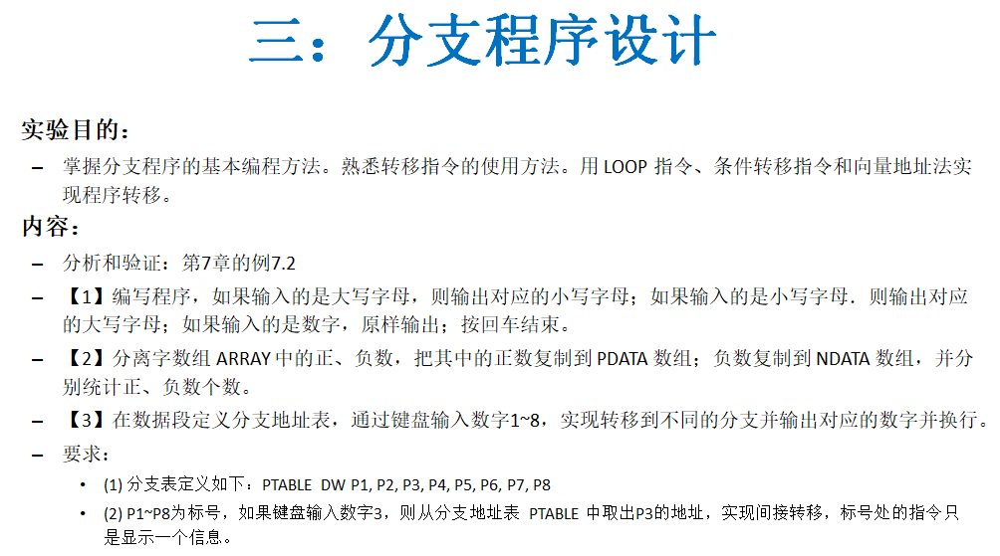
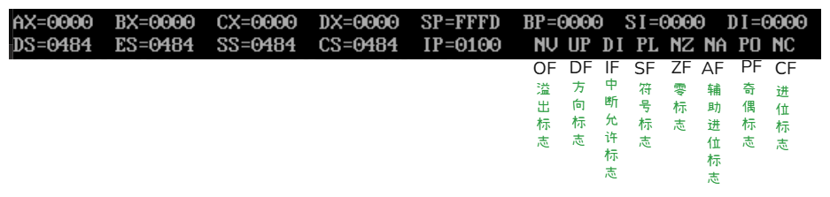
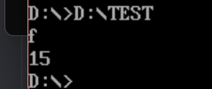
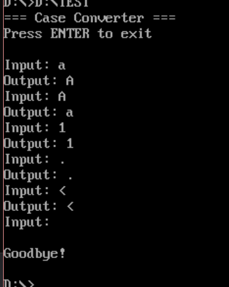
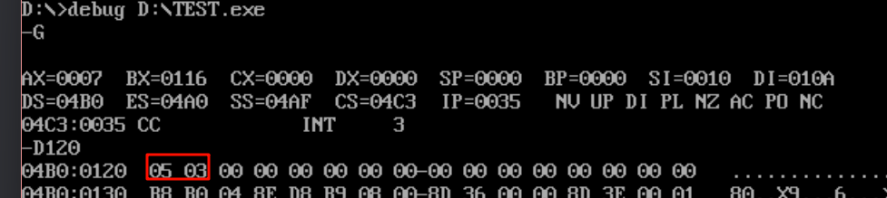
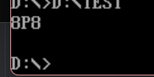

# 知识补充：

①标志寄存器



| 标志 | 置1  | 置0  | 含义     |
| ---- | ---- | ---- | -------- |
| OF   | OV   | NV   | 溢出标志 |
| DF   | DN   | UP   | 方向标志 |
| IF   | EI   | DI   | 中断标志 |
| SF   | NG   | PL   | 符号标志 |
| ZF   | ZR   | NZ   | 零标志   |
| AF   | AC   | NA   | 辅助进位 |
| PF   | PE   | PO   | 奇偶标志 |
| CF   | CY   | NC   | 进位标志 |

②CMP指令用于比较两个操作数，但不保存结果，只是根据比较结果设置标志位，为后续的条件转移指令提供判断依据。

根据比较后会设置的标志位：

| 标志位 | 名称         | 含义            | 设置条件                          |
| ------ | ------------ | --------------- | --------------------------------- |
| OF     | 溢出标志     | Overflow Flag   | 有符号溢出时OF=1                  |
| SF     | 符号标志     | Sign Flag       | 结果为负时SF=1                    |
| ZF     | 零标志       | Zero Flag       | 结果为0时ZF=1（两数相等）         |
| AF     | 辅助进位标志 | Auxiliary Carry | 低4位有借位时AF=1                 |
| PF     | 奇偶标志     | Parity Flag     | 结果低8位中1的个数为偶数时PF=1    |
| CF     | 进位标志     | Carry Flag      | 有借位时CF=1（无符号数：目的<源） |

③跳转指令

-  无符号数比较转移指令

| 指令     | 助记符含义                 | 转移条件（标志位） | 说明             | 使用场景        |
| -------- | -------------------------- | ------------------ | ---------------- | --------------- |
| **JA**   | Jump if Above              | CF=0 AND ZF=0      | 大于则转移       | 无符号数：A > B |
| **JNBE** | Jump if Not Below or Equal | CF=0 AND ZF=0      | 不小于等于则转移 | 同 JA           |
| **JAE**  | Jump if Above or Equal     | CF=0               | 大于等于则转移   | 无符号数：A ≥ B |
| **JNB**  | Jump if Not Below          | CF=0               | 不小于则转移     | 同 JAE          |
| **JB**   | Jump if Below              | CF=1               | 小于则转移       | 无符号数：A < B |
| **JNAE** | Jump if Not Above or Equal | CF=1               | 不大于等于则转移 | 同 JB           |
| **JBE**  | Jump if Below or Equal     | CF=1 OR ZF=1       | 小于等于则转移   | 无符号数：A ≤ B |
| **JNA**  | Jump if Not Above          | CF=1 OR ZF=1       | 不大于则转移     | 同 JBE          |

------

- 有符号数比较转移指令

| 指令     | 助记符含义                   | 转移条件（标志位） | 说明             | 使用场景        |
| -------- | ---------------------------- | ------------------ | ---------------- | --------------- |
| **JG**   | Jump if Greater              | ZF=0 AND SF=OF     | 大于则转移       | 有符号数：A > B |
| **JNLE** | Jump if Not Less or Equal    | ZF=0 AND SF=OF     | 不小于等于则转移 | 同 JG           |
| **JGE**  | Jump if Greater or Equal     | SF=OF              | 大于等于则转移   | 有符号数：A ≥ B |
| **JNL**  | Jump if Not Less             | SF=OF              | 不小于则转移     | 同 JGE          |
| **JL**   | Jump if Less                 | SF≠OF              | 小于则转移       | 有符号数：A < B |
| **JNGE** | Jump if Not Greater or Equal | SF≠OF              | 不大于等于则转移 | 同 JL           |
| **JLE**  | Jump if Less or Equal        | ZF=1 OR SF≠OF      | 小于等于则转移   | 有符号数：A ≤ B |
| **JNG**  | Jump if Not Greater          | ZF=1 OR SF≠OF      | 不大于则转移     | 同 JLE          |

- 无条件转移指令

| 指令    | 语法             | 说明                    | 转移范围                               |
| ------- | ---------------- | ----------------------- | -------------------------------------- |
| **JMP** | JMP 标号         | 无条件转移（段内短/近） | -128~+127（短）<br>-32768~+32767（近） |
| **JMP** | JMP FAR PTR 标号 | 无条件转移（段间远）    | 任意段                                 |
| **JMP** | JMP 寄存器       | 间接转移（段内）        | 寄存器值                               |
| **JMP** | JMP 内存         | 间接转移                | 内存中的地址                           |

③常用组合模式

| 比较意图 | CMP指令  | 无符号跳转 | 有符号跳转 |
| -------- | -------- | ---------- | ---------- |
| A > B    | CMP A, B | JA         | **JG**     |
| A ≥ B    | CMP A, B | JAE        | **JGE**    |
| A < B    | CMP A, B | JB         | **JL**     |
| A ≤ B    | CMP A, B | JBE        | **JLE**    |
| A = B    | CMP A, B | JE         | JE         |
| A ≠ B    | CMP A, B | JNE        | JNE        |

④

| 十六进制 | ASCII 名称      | 缩写 | 作用                                 |
| -------- | --------------- | ---- | ------------------------------------ |
| `0DH`    | Carriage Return | CR   | **回车**：光标回到当前行**开头**     |
| `0AH`    | Line Feed       | LF   | **换行**：光标移动到**下一行相同列** |

# test1

- 分析验证：第7章的例7.2：从键盘输入一位十六进制数，并将其转换为十进制数显示输出


①要明白输入与输出都是ASCII，所以输入的是0~9时不需要转换，而如果是大小写字母便需要转换后输出，

ASCII中数字的编码是30H~39H，大写字母的编码是41H~5AH(其中A~F是41H~46H)，小写字母的编码是61H~7A(61H~66h是a~f)，

所以如果是大小写字母要输出两位十进制数 ，而且有一个共同点，十位都是数字1。

②从分支角度讲，就需要设计条件跳转，设计标签跳转到哪里。

```asm
		;从键盘输入一位十六进制数，并将其转换为十进制数显示输出
CODE SEGMENT
ASSUME CS:CODE
START:
	MOV AH, 1H                   ;准备键盘输入
	INT 21H                      ;调用DOS中断
    CALL NEWLINE                 ;换行显示输入结果
	
	CMP AL, 30H                  ;比较是否小于'0'
	JL EXIT                      ;非法输入，退出
	CMP AL, 39H                  ;比较是否大于'9'
	JLE dig                      ;输入是0~9之间的数字，跳转处理

	CMP AL, 41H                  ;比较是否小于'A'
	JL EXIT                      ;非法输入，退出
	CMP AL, 46H                  ;比较是否大于'F'
	JLE print                    ;输入是A~F之间的字母，跳转处理
	
	CMP AL, 61H                  ;比较是否小于'a'
	JL EXIT                      ;非法输入，退出
	CMP AL, 66H                  ;比较是否大于'f'
	JG EXIT                      ;非法输入，退出
	
	SUB AL, 31H					 ;将小写字母'a'~'f'转换为对应数值
	JMP out1
print:
	SUB AL, 11H                  ;将大写字母'A'~'F'转换为对应数值
	
out1:
	MOV DL, 31H					;02H会显示dl中的字符
	MOV AH, 02H
	PUSH AX
	INT 21H                      ;十位显示1
	POP AX
	
dig:
	MOV DL, AL
	MOV AH, 02H
	INT 21H                      ;显示十进制数
	
EXIT:
	MOV AH, 4CH
	INT 21H                      ;退出程序

; 换行子程序
NEWLINE PROC
    PUSH AX
    PUSH DX

    MOV DL, 0DH        ; 回车
    MOV AH, 02H		   
    INT 21H

    MOV DL, 0AH        ; 换行
    MOV AH, 02H
    INT 21H
	
    POP DX
    POP AX
    RET
NEWLINE ENDP
CODE ENDS
	END START
```

③至于这个换行子程序只是调用了ASCII中回车0DH，换行0AH，其实如果ASCII记不住可以直接用引号包裹表示，如回车是1不写31H而写”1“，不过回车换行是不支持的。



# test2

- 编写程序，如果输入的是大写字母，则输出对应的小写字母；如果输入的是小写字母．则输出对应的大写字母；如果输入的是数字，原样输出；按回车结束。

①

| 代码片段   | 作用                                |
| ---------- | ----------------------------------- |
| `DB`       | 定义字节（字符串或数值）            |
| `0DH, 0AH` | 回车 + 换行（DOS 的换行方式）       |
| `$`        | `INT 21H / AH=09H` 的字符串结束标志 |
| 多行 `DB`  | 只是书写换行，实际上字符串是连续的  |

②要实现不停的输入，就不仅仅是一个分支程序，需要在外面包裹一个循环，不过不能用loop这种有次数限制的，只能自己设置跳转条件然后用jmp实现

```asm
; 输入小写转大写，输入大写转小写，其他字符原样输出
; 每次转换后换行，按回车键退出

DATA SEGMENT
    MSG_PROMPT  DB '=== Case Converter ===', 0DH, 0AH
                DB 'Press ENTER to exit', 0DH, 0AH, '$'
    MSG_INPUT   DB 'Input: $'
    MSG_OUTPUT  DB 'Output: $'
    MSG_EXIT    DB 'Goodbye!', 0DH, 0AH, '$'
DATA ENDS

CODE SEGMENT
    ASSUME CS:CODE, DS:DATA
    
START:
    MOV AX, DATA
    MOV DS, AX
    
    ; 显示提示信息
    MOV AH, 09H
    LEA DX, MSG_PROMPT
    INT 21H
    
INPUT_LOOP:
    ; 换行
    CALL NEWLINE
    
    ; 显示输入提示
    LEA DX, MSG_INPUT
    MOV AH, 09H
    INT 21H
    
    ; 键盘输入
    MOV AH, 01H
    INT 21H
    
    ; 检查是否按回车键退出
    CMP AL, 0DH              ; 回车键的ASCII码是0DH
    JE EXIT_PROGRAM
    
    ; 保存输入字符
    MOV BL, AL
    
    ; 检查是否为大写字母 A-Z
    CMP AL, 41H              ; 'A'
    JL NOT_LETTER
    CMP AL, 5AH              ; 'Z'
    JG CHECK_LOWER
    
    ; 是大写字母，转换为小写
    ADD AL, 20H
    JMP OUTPUT_RESULT
    
CHECK_LOWER:
    ; 检查是否为小写字母 a-z
    CMP AL, 61H              ; 'a'
    JL NOT_LETTER
    CMP AL, 7AH              ; 'z'
    JG NOT_LETTER
    
    ; 是小写字母，转换为大写
    SUB AL, 20H
    JMP OUTPUT_RESULT
    
NOT_LETTER:
    ; 非字母字符，保持不变
    ; AL中已经是原字符
    
OUTPUT_RESULT:
    ; 换行
    CALL NEWLINE
    
    ; 显示输出提示
    PUSH AX                  ; 保存转换后的字符
    LEA DX, MSG_OUTPUT
    MOV AH, 09H
    INT 21H
    POP AX                   ; 恢复转换后的字符
    
    ; 显示转换后的字符
    MOV DL, AL
    MOV AH, 02H
    INT 21H
    
    ; 继续输入
    JMP INPUT_LOOP
    
EXIT_PROGRAM:
    ; 换行并显示退出信息
    CALL NEWLINE
    LEA DX, MSG_EXIT
    MOV AH, 09H
    INT 21H
    
    ; 退出程序
    MOV AH, 4CH
    INT 21H

; 换行子程序
NEWLINE PROC
    PUSH AX
    PUSH DX
    MOV DL, 0DH              ; 回车
    MOV AH, 02H
    INT 21H
    MOV DL, 0AH              ; 换行
    MOV AH, 02H
    INT 21H
    POP DX
    POP AX
    RET
NEWLINE ENDP

CODE ENDS
    END START
```

③其实抛开循环这就是上一题的简化



# test3

- 分离字数组ARRAY中的正、负数，把其中的正数复制到PDATA数组；负数复制到NDATA数组，并分
  别统计正、负数个数。

①字数组要用DW定义，因为每个字占用两个字节，因此计算长度时要除以二，还有一个要点就是寻址方式的选择，用直接寻址加偏移寻址将数字送到寄存器，用寄存器间接寻址，将数字存入不同数组

```asm
;分离字数的正负数，分别存入不同数组，并统计正负数个数
DATA SEGMENT
    ARRARY DW 10, -1, 5, -6, 3, 8, -2, 7
    ARRLEN EQU ($ - ARRARY) / 2
    ORG 100H
    PDATA  DW 10 DUP (?)
    ORG 110H
    NDATA  DW 10 DUP (?)
    ORG 120H
    POSITIVE_COUNT DB 0
    NEGATIVE_COUNT DB 0
DATA ENDS

CODE SEGMENT
    ASSUME CS:CODE, DS:DATA
START:
    MOV AX, DATA
    MOV DS, AX

    MOV CX, ARRLEN         ; 循环次数 = 元素个数
    LEA SI, ARRARY         ; SI → 输入数组
    LEA DI, PDATA          ; DI → 正数数组
    LEA BX, NDATA          ; BX → 负数数组

COUNT_LOOP:
    MOV AX, [SI]           ; AX = 当前元素
    CMP AX, 0
    JL IS_NEGATIVE         ; 如果是负数，跳转到 IS_NEGATIVE

    ; 正数
    MOV [DI], AX
    ADD DI, 2
    INC POSITIVE_COUNT
    JMP NEXT

IS_NEGATIVE:
    MOV [BX], AX
    ADD BX, 2
    INC NEGATIVE_COUNT

NEXT:
    ADD SI, 2              ; 下一个输入元素
    LOOP COUNT_LOOP

    INT 3              ; 设置断点，调试时执行g命令会停在这里
    MOV AH, 4CH
    INT 21H
CODE ENDS
END START
```

②可以看到正确输出了自定义数组的正负数个数



# test4

- 在数据段定义分支地址表，通过键盘输人数字1~8，
  要求：
  (1)分支表定义如下：PTABLE DW P1,P2,P3,P4,P5,P6,P7,P8
  (2)P1~P8为标号，如果键盘输入数字3，则从分支地址表PTABLE 中取出P3的地址，实现间接转移，标号处的指令只

①定义一个分支向量，如果说一个数符合要求就能进行跳转，但是这里有一个坑，分支表每个分支是一个字也就是16位，一个分支是占两个字节地址的，把输入的数作为索引时，要在索引的基础上乘2，才能偏移寻址到正确地址。shl是二进制的逻辑与算术左移，所以比起mul更快。

```asm
DATA SEGMENT
	MSG1 DB 'P1', 0AH, 0DH, '$'
	MSG2 DB 'P2', 0AH, 0DH, '$'
	MSG3 DB 'P3', 0AH, 0DH, '$'
	MSG4 DB 'P4', 0AH, 0DH, '$'
	MSG5 DB 'P5', 0AH, 0DH, '$'
	MSG6 DB 'P6', 0AH, 0DH, '$'
	MSG7 DB 'P7', 0AH, 0DH, '$'
	MSG8 DB 'P8', 0AH, 0DH, '$'
	
	PTABLE DW P1, P2, P3, P4, P5, P6, P7, P8    ;跳转表
DATA ENDS	
CODE SEGMENT
    ASSUME CS:CODE, DS:DATA
START:
	MOV AX, DATA
	MOV DS, AX
	
	; 读取键盘输入（字符）
	MOV AH, 01H
	INT 21H                      ; AL = ASCII of '1' to '8'
	
	CMP AL, '1'
	JB EXIT                      ; 小于 '1'，退出
	CMP AL, '8'
	JA EXIT                      ; 大于 '8'，退出
	
	SUB AL, '0'                  ; 转为数字 1~8
	DEC AL                       ; 转为索引 0~7
	
	MOV AH, 0                    ; 清高字节
	SHL AX, 1                    ; AX = index * 2
	MOV SI, AX                   ; SI = 偏移量
	
	; 间接跳转：跳转到 PTABLE[SI] 指向的地址
	JMP WORD PTR PTABLE[SI]
	
P1:
	LEA DX, MSG1
	JMP DISPLAY
P2:
	LEA DX, MSG2
	JMP DISPLAY
P3:
	LEA DX, MSG3
	JMP DISPLAY
P4:
	LEA DX, MSG4
	JMP DISPLAY
P5:
	LEA DX, MSG5
	JMP DISPLAY
P6:
	LEA DX, MSG6
	JMP DISPLAY
P7:
	LEA DX, MSG7
	JMP DISPLAY
P8:
	LEA DX, MSG8
	JMP DISPLAY
	
DISPLAY:
	MOV AH, 09H
	INT 21H
	
EXIT:
	MOV AH, 4CH
	INT 21H
	
CODE ENDS
	 END START
```

