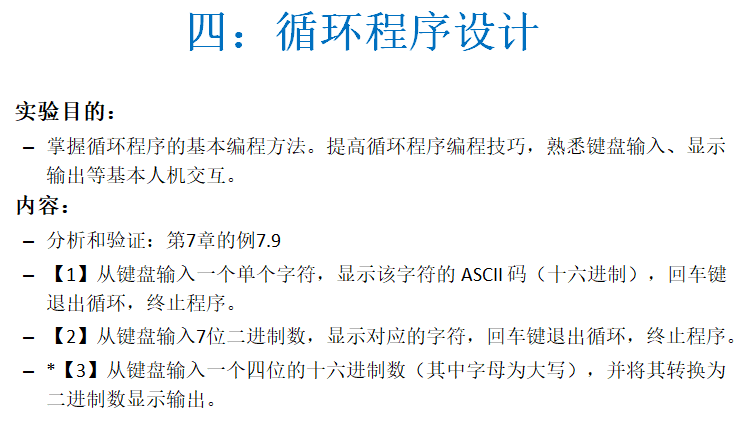
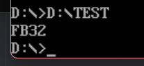
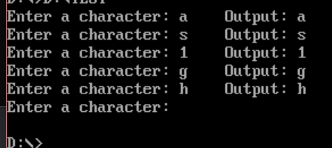
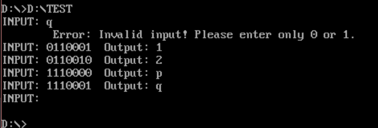
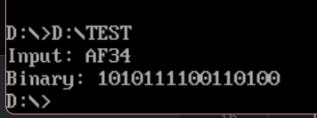

①循环控制指令

| 指令       | 助记符含义           | 转移条件      | 说明                       |
| ---------- | -------------------- | ------------- | -------------------------- |
| **LOOP**   | Loop                 | CX≠0          | CX自减1，不为0则转移       |
| **LOOPZ**  | Loop While Zero      | CX≠0 AND ZF=1 | CX自减1，不为0且ZF=1则转移 |
| **LOOPE**  | Loop While Equal     | CX≠0 AND ZF=1 | 同 LOOPZ                   |
| **LOOPNZ** | Loop While Not Zero  | CX≠0 AND ZF=0 | CX自减1，不为0且ZF=0则转移 |
| **LOOPNE** | Loop While Not Equal | CX≠0 AND ZF=0 | 同 LOOPNZ                  |

  ②8086 中，若移位计数大于 1，必须放在 CL 中，不能直接用立即数，或者字段自己重复写几次。

# test1

- 分析验证：把BX寄存器中的二进制数用十六进制数格式显示输出

①自己随便往bx输入一个立即数，注意输入16进制时如果首数字时字母要加一个0在前面，以免编译器无法正确识别

②寄存器16位，每四位一个16进制数，而dos打印功能号02H是打印DL中的ASCII对应符号也就是八位，所以需要分四次每次取出四位然后扩展到八位对应到ascii。

```asm
CODE SEGMENT
    ASSUME CS:CODE
START:
    MOV BX,0FB32H 
    MOV CX,4    ;循环次数，4次
SHIFT:          ;循环左移四位
    ROL BX,1
    ROL BX,1
    ROL BX,1
    ROL BX,1

    MOV AL,BL
    AND AL,0FH  ;按位与，取低四位
    ADD AL,30H  ;转换为ASCII码
    
    CMP AL,39H  ;判断是否大于9
    JLE DIG     ;如果小于等于9，跳转输出
    ADD AL,07H  ;转换为A-F的ASCII码
DIG:
    MOV DL,AL
    MOV AH,02H
    INT 21H
    LOOP SHIFT
    
    MOV AH,4CH
    INT 21H
CODE ENDS
    END START   
```



# test2

- 从键盘输入一个单个字符，显示该字符的ASCI码（十六进制），回车键退出循环，终止程序。

①从键盘输入的字符是存在AL八位数，再怎么样不会变成16位，也就是输入什么就输出什么，本来就是ascii值，只是要把al转移到bl才能输出。

②难点是这是条件循环而不是次数循环，这样就不能用loop，要用jmp来实现

```asm
DATA SEGMENT
    MSG_INPUT DB 'Enter a character: $'      ; 提示信息：输入字符
    MSG_OUTPUT DB 09H,'Output: $'            ; 输出信息：09H是Tab制表符
DATA ENDS

CODE SEGMENT
    ASSUME CS:CODE, DS:DATA
START:
    MOV AX, DATA                             ; 将数据段地址加载到AX
    MOV DS, AX                               ; DS指向数据段
    
CH_INPUT:                                    ; 字符输入循环开始
    LEA DX, MSG_INPUT                        ; DX指向提示信息
    MOV AH, 09H                              ; 09H功能：显示字符串
    INT 21H                                  ; 调用DOS中断，显示"Enter a character: "
    
    MOV AH, 01H                              ; 01H功能：键盘输入单个字符（有回显）
    INT 21H                                  ; 输入的字符保存在AL中
    
    CMP AL, 0DH                              ; 比较AL与回车键（0DH=13）
    JE EXIT                                  ; 如果是回车键，跳转到EXIT退出程序
    
    LEA DX, MSG_OUTPUT                       ; DX指向输出信息
    MOV AH, 09H                              ; 09H功能：显示字符串
    INT 21H                                  ; 显示"    Output: "（Tab+Output）
    
    MOV DL, AL                               ; 将输入的字符从AL复制到DL
    MOV AH, 02H                              ; 02H功能：显示单个字符
    INT 21H                                  ; 显示刚才输入的字符
    
    ; 输出回车符
    MOV DL, 0DH                              ; 0DH是回车符CR（Carriage Return）
    MOV AH, 02H                              ; 02H功能：显示单个字符
    INT 21H                                  ; 光标移到行首
    
    ; 输出换行符
    MOV DL, 0AH                              ; 0AH是换行符LF（Line Feed）
    MOV AH, 02H                              ; 02H功能：显示单个字符
    INT 21H                                  ; 光标移到下一行
    
    JMP CH_INPUT                             ; 无条件跳转，继续下一轮输入
    
EXIT:                                        ; 程序退出
    MOV AH, 4CH                              ; 4CH功能：终止程序
    INT 21H                                  ; 返回DOS
CODE ENDS
    END START
```



# test3

- 从键盘输入7位二进制数，显示对应的字符，回车键退出循环，终止程序。

①进行限制型输入——限制只能输入0和1，输入完后进行移位操作，循环七次就能得到一个七位二进制数，正好可以对应一个asscii的值

```asm
DATA SEGMENT
    MSG_INPUT DB 'INPUT: $'           ; 输入提示信息
    MSG_OUTPUT DB 09H,'Output: $'     ; 输出提示信息，09H是制表符
    MSG_ERROR DB 09H,'Error: Invalid input! Please enter only 0 or 1.$'  ; 错误信息
    NEWLINE DB 0DH,0AH,'$'            ; 回车换行符
DATA ENDS

CODE SEGMENT
    ASSUME CS:CODE, DS:DATA           ; 指定段寄存器对应的段
START:
    MOV AX,DATA
    MOV DS,AX                         ; 初始化数据段寄存器

INPUT:
    MOV BX,0                          ; 清空BX，用于存储二进制转换结果
    MOV CX,7                          ; 设置循环计数器，最多输入7位二进制数

    LEA DX,MSG_INPUT                  ; 显示输入提示
    MOV AH,09H
    INT 21H

INLOG:
    MOV AH,01H                        ; 从键盘读取一个字符
    INT 21H

    CMP AL,0DH                        ; 检查是否按下回车键
    JE EXIT                           ; 如果按回车，则退出程序

    CMP AL,30H                        ; 检查输入是否小于'0'
    JB INVALID_INPUT                  ; 如果小于'0'，跳转到无效输入处理
    CMP AL,31H                        ; 检查输入是否大于'1'
    JA INVALID_INPUT                  ; 如果大于'1'，跳转到无效输入处理

    SUB AL,30H                        ; 将ASCII字符转换为数字（'0'->0, '1'->1）
    SHL BL,1                          ; 将BL左移一位，为新的二进制位腾出空间
    ADD BL,AL                         ; 将当前位添加到BL中
    LOOP INLOG                        ; 继续读取下一位，CX减1，如果不为0则循环

DISPLAY:
    LEA DX,MSG_OUTPUT                 ; 显示输出提示
    MOV AH,09H
    INT 21H

    MOV AH,02H                        ; 显示字符功能
    MOV DL,BL                         ; 将二进制转换结果放入DL
    INT 21H                           ; 显示结果（注意：这里显示的是ASCII字符，不是数字）

    LEA DX,NEWLINE                    ; 输出换行
    MOV AH,09H
    INT 21H

    JMP INPUT                         ; 跳回输入阶段，继续下一次输入

INVALID_INPUT:
    LEA DX,NEWLINE                    ; 输出换行
    MOV AH,09H
    INT 21H

    LEA DX,MSG_ERROR                  ; 显示错误信息
    MOV AH,09H
    INT 21H

    LEA DX,NEWLINE                    ; 输出换行
    MOV AH,09H
    INT 21H

    JMP INPUT                         ; 跳回输入阶段，重新开始输入

EXIT:
    MOV AH,4CH                        ; 程序退出功能
    INT 21H                           ; 退出程序

CODE ENDS
    END START                         ; 程序结束，从START开始执行
```



# test4

- 从键盘输入一个四位的十六进制数（其中字母为大写），并将其转换为二进制数显示输出。

①首先要考虑如何存储四位16进制数，可能很容易想到一个寄存器正好16位正好存储一个四位16进制数，这样每次移动四位然后，通过位或的操作录入一个输入。

②将16位二进制存到一个寄存器后，在进行向左移位，每溢出移位到CF就打印一位，重复16次。

```asm
DATA SEGMENT
    PROMPT DB 'Input: $'
    RESULT DB 0DH, 0AH, 'Binary: $'
    HEX_NUM DW 0        ; 存储转换后的十六进制数
    BIN_STR DB 16 DUP('0'), '$'  ; 存储二进制字符串
DATA ENDS

CODE SEGMENT
    ASSUME CS:CODE, DS:DATA
    
START:
    MOV AX, DATA
    MOV DS, AX
    
    ; 显示提示信息
    LEA DX, PROMPT
    MOV AH, 09H
    INT 21H
    
    ; 输入4个十六进制字符
    MOV CX, 4           ; 循环4次
    MOV BX, 0           ; BX用于累积结果
    
INPUT_LOOP:
    MOV AH, 01H         ; 键盘输入一个字符
    INT 21H
    
    ; 将BX左移4位，为新的十六进制位腾出空间
    SHL BX, 1
    SHL BX, 1
    SHL BX, 1
    SHL BX, 1
    
    ; 判断输入字符是数字还是字母
    CMP AL, '9'
    JBE IS_DIGIT        ; 如果 <= '9'，是数字
    
    ; 是字母A-F
    SUB AL, 'A'         ; 'A' -> 0, 'B' -> 1, ...
    ADD AL, 10          ; 转换为10-15
    JMP ADD_TO_BX
    
IS_DIGIT:
    SUB AL, '0'         ; '0' -> 0, '1' -> 1, ...
    
ADD_TO_BX:
    OR BL, AL           ; 将当前位加入BX的低4位
    LOOP INPUT_LOOP
    
    ; 将结果保存
    MOV HEX_NUM, BX
    
    ; 显示结果提示
    LEA DX, RESULT
    MOV AH, 09H
    INT 21H
    
    ; 将十六进制数转换为二进制字符串
    MOV CX, 16          ; 16位二进制
    LEA DI, BIN_STR     ; DI指向二进制字符串
    MOV BX, HEX_NUM
    
CONVERT_LOOP:
    SHL BX, 1           ; 左移一位，最高位进入CF
    JB SET_ONE          ; 如果CF=1，设置为'1'
    
    MOV BYTE PTR [DI], '0'
    JMP NEXT_BIT
    
SET_ONE:
    MOV BYTE PTR [DI], '1'
    
NEXT_BIT:
    INC DI
    LOOP CONVERT_LOOP
    
    ; 显示二进制字符串
    LEA DX, BIN_STR
    MOV AH, 09H
    INT 21H
    
    ; 程序结束
    MOV AH, 4CH
    INT 21H
    
CODE ENDS
    END START
```

