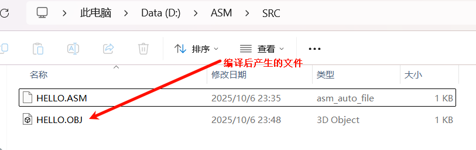

# 一、基础铺垫

## 1.汇编语言是啥？

汇编语言（Assembly Language）是一种**介于机器语言和高级语言之间的编程语言**。

- 机器语言：计算机能直接执行的二进制代码（比如 `10110000 01100001`）
- 汇编语言：用**英文单词**代替机器指令（比如 `MOV AL, 61h`）
- 高级语言：C、Python、Java 之类（人类看得懂）

所以汇编语言就是一种**给人看的机器语言**。

------

## 2.为什么要学汇编？

- 能搞懂计算机底层是怎么运行的。
- 了解寄存器、内存、CPU 之间怎么交互。
- 优化程序性能（尤其是系统级或嵌入式）。
- 想学操作系统、编译原理、逆向工程、网络安全。

## 3.学习的目标

能看懂常用的汇编代码，进行简单的汇编编程，能够加深对计算机学科体系的理解。

## 4.汇编语言前置知识

| 序号 | 知识类别                              | 说明                                 | 举例                                   |
| ---- | ------------------------------------- | ------------------------------------ | -------------------------------------- |
| ①    | **计算机组成原理（CPU、内存、总线）** | 理解计算机内部是怎么“执行一条指令”的 | 程序计数器、寄存器、内存地址、指令周期 |
| ②    | **二进制与数制转换**                  | 汇编操作的都是二进制/十六进制数据    | `1010b = 10d = Ah`                     |
| ③    | **数据存储单位与补码**                | 了解字节、字、双字，以及有符号数表示 | 8位=1字节（Byte），16位=1字（Word）    |
| ④    | **操作系统基本概念**                  | 程序怎么运行在内存中？栈是怎么用的？ | 内存分段、进程地址空间                 |
| ⑤    | **简单的编程逻辑**                    | 变量、循环、条件判断这些概念         | if、while、函数参数传递                |
| ⑥    | **计算机指令和寄存器的概念**          | 汇编操作的就是这些硬件资源           | MOV、ADD、JMP，AX、BX、CX、DX 等寄存器 |

### 4.1 计算机组成原理

（1）冯诺依曼结构


如上图是冯诺依曼结构的大致，这是对计算机组成一个大体上粗浅的理解，而冯诺依曼结构有以下特点：

- **a.采用二进制**
  - 计算机使用二进制（0和1）来表示所有指令和数据。这是因为二进制系统在物理上最容易实现（如电路的通断、高低电平），具有抗干扰能力强、可靠性高等优点。
- **b.程序存储**
  - 这是冯·诺依曼结构**最革命性的思想**。**程序（指令）和数据以二进制形式一同存放在存储器中**。计算机在工作时，能够从存储器中自动读取并执行指令。
  - 在此之前，计算机的程序是通过物理方式（如插拔线路、打孔纸带）设置的，改变程序非常困难。程序存储概念使得计算机成为真正的“通用机器”。
- **c.计算机由五大部件组成**
  - 根据冯·诺依曼结构，计算机必须包含以下五个基本部分：
    - **运算器**：负责执行所有的算术运算和逻辑运算。
    - **控制器**：是整个计算机的指挥中心，负责从存储器中取出指令、分析指令，然后向其他部件发出控制信号，以协调各部件工作。
    - **存储器**：用于存放程序和数据。现代计算机中通常分为内存（主存）和外存（辅存）。
    - **输入设备**：用于将程序和数据输入到计算机中，如键盘、鼠标。
    - **输出设备**：用于将计算机处理的结果输出出来，如显示器、打印机。
  - **通常将运算器和控制器合称为中央处理器**。
- **d.以运算器为中心**
  - 在经典的冯·诺依曼结构中，所有数据的流动都**以运算器为中心**。输入设备输入的数据、存储器读取的数据，都必须先送到运算器进行处理，处理后的结果再送回存储器或输出设备。
  - **注意**：在现代计算机中，这个中心已经逐渐转移到了**存储器**，形成了“以存储器为中心”的结构，这主要是为了解决运算器成为性能瓶颈的问题。
- **e.指令顺序执行**
  - 指令在存储器中通常是按照地址顺序存放的。控制器在执行程序时，一般会按顺序逐条取出指令、分析指令、执行指令。当然，程序中也包含控制指令（如跳转、循环），可以改变执行顺序。

（2）冯诺依曼结构与哈佛结构最大的区别：冯诺依曼结构中指令和数据共享同一个存储空间（内存）和同一组总线，哈佛结构中指令和数据拥有独立的存储空间和独立的总线。

（3）现代计算机的结构可以看作是 ，一个以CPU为核心的控制系统，与一个以GPU为核心的并行计算系统，通过共享存储器和高带宽总线紧密耦合而成的混合体，可以说是在冯诺依曼结构基础上结合哈佛结构的改进。


### 4.2 二进制与数制转换

**（1）其他进制 → 十进制：按权展开-->求和法**
$$
\begin{eqnarray}
\text { 按权展开公式：}\\
N_{10} & = & a_{n-1} \times r^{n-1}+a_{n-2} \times r^{n-2}+\cdots+a_{1} \times r^{1}+a_{0} \times r^{0}+a_{-1} \times r^{-1}+a_{-2} \times r^{-2}+\cdots
\end{eqnarray}
$$
数制转换示例

例1：二进制 → 十进制
$$
(1011.01)_2 = 1 \times 2^3 + 0 \times 2^2 + 1 \times 2^1 + 1 \times 2^0 + 0 \times 2^{-1} + 1 \times 2^{-2}
$$

$$
= 8 + 0 + 2 + 1 + 0 + 0.25 = 11.25_{10}
$$

$$
✅ 答案: (1011.01)_2 = (11.25)_{10}
$$


例2：八进制 → 十进制
$$
(745)_8 = 7 \times 8^2 + 4 \times 8^1 + 5 \times 8^0 = 448 + 32 + 5 = 485_{10}
$$

$$
✅ 答案: (745)_8 = (485)_{10}
$$


例3：十六进制 → 十进制
$$
(3A)_{16} = 3 \times 16^1 + A \times 16^0 = 3 \times 16 + 10 \times 1 = 58_{10}
$$

$$
✅ 答案: (3A)_{16} = (58)_{10}
$$


**（2）十进制→ 其他进制：除基取余（整数） / 乘基取整（小数）**

例1：将十进制23转换成二、八、十六进制

  


如左图所示，将十进制23转换成二进制为：101111

 


 

 

 将十进制23转换成八进制为：27


 

 将十进制23转换为十六进制为：18


例2：将十进制0.34转换成二、八、十六进制

 

 如左图所示，将十进制0.34转换成二进制，只需一直将小数部分乘2，然后取整数部分为二进制小数部分，然后继续将小数部分乘二，循环以此，

 最后可以得到0.010101110……暂时算到九位，因为数学上的原因最后是无限不循环的，只能做到无限接近。


十进制0.34转八进制

 

 结果：
$$
\left ( 0.34 \right )_{10}≈\left ( 0.2560507… \right )_{8}
$$


十进制 0.34 转十六进制

  

 

 答案：
$$
\left ( 0.34 \right )_{10}≈\left ( 0.570A3D…  \right )_{16}
$$


**（3） 二进制 ↔ 八进制 / 十六进制**

**方法：分组转换法**。因为 `8 = 2^3`, `16 = 2^4`，所以可以按位权对应分组。

- **二进制 → 八进制**：以小数点为界，向左和向右**每3位二进制一组**，不足3位的用0补足，然后将每一组转换成对应的八进制数。
- **八进制 → 二进制**：将每一位八进制数**展开成3位二进制数**。
- **二进制 → 十六进制**：以小数点为界，向左和向右**每4位二进制一组**，不足4位的用0补足，然后将每一组转换成对应的十六进制数。
- **十六进制 → 二进制**：将每一位十六进制数**展开成4位二进制数**。

**示例：二进制 `101101011.11011B` 转八进制和十六进制**

**转八进制（3位一组）**：

```txt
二进制分组： 101 | 101 | 011 . 110 | 110
八进制对应：  5     5     3  .  6     6
```

结果：`553.66O`

**转十六进制（4位一组）**：

```txt
二进制分组： 0001 | 0110 | 1011 . 1101 | 1000
十六进制对应： 1      6      B   .   D      8
```

结果：`16B.D8H`


### 4.3 数据存储单位与补码

**（1） 数据存储单位**

a. 位（Bit）

- **定义**：计算机中最小的存储单位，中文是“**二进制位**”。
- **数值**：一个位只能表示一个**0** 或 一个**1**。
- **重要性**：位是构成所有数据的基础。

b.字节（Byte）

- **定义**：计算机中**最基本、最常用**的存储单位。它由一组连续的位构成。
- **换算**：**1 字节 = 8 位**。
- **意义**：一个字节可以有 28=25628=256 种不同的组合（从 `00000000` 到 `11111111`）。这使得它可以表示一个ASCII字符（如 ‘A’、‘7’、‘!’）、一个0到255之间的整数等。

c.字（word）

​	**1word=2Bytes(字节)=16(bits)**,估计是因为计算机时美国发明的，而编码时两个字节可以覆盖所有的英文字母。

d.更大的单位

随着数据量增大，我们需要更大的单位。它们通常以 **1024（即 210210）** 为进制倍数，因为计算机是二进制的。

- 1 Kilobyte (KB) = 1024 Bytes
- 1 Megabyte (MB) = 1024 KB = 1024210242 Bytes
- 1 Gigabyte (GB) = 1024 MB = 1024310243 Bytes
- 1 Terabyte (TB) = 1024 GB = 1024410244 Bytes
- 1 Petabyte (PB) = 1024 TB = 1024510245 Bytes

**注意**：在某些上下文中（如硬盘制造商），也可能用 **1000** 作为进制，但在计算机科学和操作系统层面，通常默认使用1024。

------

**(2) 补码**

补码是一种用二进制表示有符号整数（正数、负数和零）的方法。它是现代计算机系统中表示负数的**标准**。


a. 为什么需要补码？

在计算机中，如果直接用最高位当符号位（0正1负），剩下的位表示数值（这种方式叫“原码”），会带来两个问题：

1. **存在两个零**：`+0` (00000000) 和 `-0` (10000000)，这会造成计算和逻辑上的混乱。
2. **加减运算复杂**：CPU的电路设计会变得复杂，因为需要分别处理符号和数值。

**补码完美地解决了这两个问题**，它让加法和减法可以使用同一套加法器电路来完成，极大地简化了硬件设计。


b. 补码的定义和转换规则

- **正数的补码**：与其原码相同。
  - 例如：`+5` 的补码就是 `0000 0101`。
- **负数的补码**：可以通过以下步骤得到：
  1. **写出该数绝对值的原码**。
  2. **按位取反**（0变1，1变0），得到“反码”。
  3. **在反码的末位加1**。
- **零的补码**：只有一个，就是全0。


**示例：求 `-5` 的补码**

1. `+5` 的原码：`0000 0101`
2. 按位取反：`1111 1010` （这就是 `-5` 的反码）
3. 末位加1：`1111 1011` （这就是 `-5` 的补码）

所以，在8位系统中，`-5` 的存储形式是 `1111 1011`。


(3) 补码的运算优势

补码最大的优点是：**可以将减法运算转换为加法运算**。

**示例：计算 7 - 5**
这等价于 7 + (-5)

- `7` 的补码： `0000 0111`

- `-5` 的补码： `1111 1011`

- 将它们相加：

  ```txt
    0000 0111  (7)
  + 1111 1011  (-5)
  ------------
  1 0000 0010
  ```

- 由于是在8位系统中，最前面的进位 `1` 会**自然丢弃**（这叫“溢出”）。

- 剩下的结果是 `0000 0010`，也就是 `2`。


### 4.4 操作系统基本概念

 操作系统是**管理计算机硬件和软件资源**、并为用户和应用程序提供接口的**系统软件**。
 👉 简单说：**它是用户与计算机硬件之间的桥梁**。


### 4.5 稍微认识汇编语言

（1） 一个最简单的汇编指令：

```assembly
;一个简单的汇编指令
mov ax,bx ;将BX内容加载到AX
```

a.意思是把寄存器bx的内容送到ax中，注意是后面的寄存器的内容送到前面。

b.汇编语言的注释由(;)开始，独占一行或跟在指令后面

c.汇编语言不区分字母大小写，但有些汇编器区分。

d.编译过程:


e.汇编器是指把汇编语言翻译成机器语言的软件，编译器是将一种编程语言翻译成另一种编程语言的软件。


（2）汇编语言的组成

a.**汇编指令：**机器码的助记符，有对应的的机器码；

b.**伪指令：**没有对应的机器码，由编译器执行，计算机并不执行；

c.**其他符号:** 如+-*/等，由编译器识别，计算机并不执行。

核心是汇编指令，它决定了汇编语言的特性。

### 4.6 寄存器

(1)对现代计算机结构的进一步认识

如果说有条件，现在想马上自己组装一台台式电脑，虽然有想但也没想，于是乎搜索了一些装机教程，对计算机的组成有了进一步了解，下图是华硕官网上一主板的实物图


进而了解到


然后看别人科普视频得到的图，这里的二级经销商就是南桥，承担了一些低速输入输出设备的控制，分担CPU压力


进而可以有一个总线的概念，总线（Bus）是计算机内部各个部件之间传递信息的公共通道，像上图什么“高速直达”等连接起来的线路就叫总线，物理意义上讲，总线其实就是电线，但其经过精妙的设计，能够传递数据。

（2）关于寄存器的来历


从电脑到cpu无非就是一个不断获取输入处理后进行输出，需要不断地从内存读取数据，而从材料上讲，内存存取的速度远远低于CPU核心（控制器与运算器），所以匹配了不同速度存放数据的容器


（3）寄存的作用

cpu与外部相连的总线叫外部总线，内部各个器件的总线叫内部总线，而寄存器就是cpu内部存储指令与数据的器件。通过汇编语言来控制寄存器进而实现对cpu的控制。

（4）认识不同寄存器

不同cpu中寄存器数量，作用不同，最经典的CPU就是Intel8086，学习汇编也是以它为起点。

**核心特点：** 8086 是一个 **16位** CPU，其内部几乎所有寄存器都是 **16位** 宽。它采用了 **分段内存模型** 来管理超过 16 位寻址极限（64KB）的内存。

8086 的寄存器可以分为四大类，如下图所示：


**a. 通用寄存器 - 数据操作的核心**

这类寄存器用于临时存放数据和地址，是程序中使用最频繁的寄存器。它们都可以被分为两个独立的 **8位** 寄存器来使用。

**数据寄存器**

| 16位寄存器 | 高8位 | 低8位 | 主要用途                                                     |
| :--------- | :---- | :---- | :----------------------------------------------------------- |
| **AX**     | AH    | AL    | **累加器**。是算术运算的**主寄存器**，也是所有I/O操作的默认寄存器。 |
| **BX**     | BH    | BL    | **基址寄存器**。常用于存放**内存地址**（作为指针）。         |
| **CX**     | CH    | CL    | **计数寄存器**。在循环和字符串操作中作为**计数器**。         |
| **DX**     | DH    | DL    | **数据寄存器**。在AX不够用时存放数据，也用于I/O端口寻址。    |

**举例：**

- `MOV AX, 1234H` // 将 16 进制数 1234 送入 AX，此时 AH=12H, AL=34H
- `MOV CL, 5`   // 将 5 送入 CX 的低 8 位 CL
- `LOOP label`   // CX 自动减 1，如果 CX≠0 则跳转到 label

**指针与变址寄存器**

| 16位寄存器 | 主要用途                                                 |
| :--------- | :------------------------------------------------------- |
| **SP**     | **栈指针**。永远指向当前**栈顶**。                       |
| **BP**     | **基址指针**。常用于在栈帧中寻址**参数和局部变量**。     |
| **SI**     | **源变址寄存器**。在字符串操作中作为**源地址指针**。     |
| **DI**     | **目的变址寄存器**。在字符串操作中作为**目的地址指针**。 |

------

**b. 段寄存器 - 内存管理的基石**

这是8086架构最核心、最具特色的部分。由于8086的地址总线是20位（可寻址1MB内存），而寄存器只有16位，为了解决这个矛盾，Intel设计了 **分段内存模型**。

**物理地址计算公式：`物理地址 = 段地址 × 16 + 偏移地址`**

| 段寄存器 | 全称       | 主要用途                                           |
| :------- | :--------- | :------------------------------------------------- |
| **CS**   | **代码段** | 存放当前正在执行的**程序代码**的段地址。           |
| **DS**   | **数据段** | 存放程序使用的**主要数据**的段地址。               |
| **SS**   | **堆栈段** | 存放**堆栈**的段地址。                             |
| **ES**   | **附加段** | 存放**辅助数据**（如字符串操作的目的地）的段地址。 |

**举例：**
如果 `CS = 0x2000`， `IP = 0x0030`，那么下一条要执行的指令的物理地址是：
`0x2000 × 16 + 0x0030 = 0x20000 + 0x0030 = 0x20030`

------

**c. 指令指针**

| 寄存器 | 全称         | 主要用途                                                     |
| :----- | :----------- | :----------------------------------------------------------- |
| **IP** | **指令指针** | 永远存放下一条要执行的指令在**代码段内的偏移地址**。与 **CS** 寄存器共同决定指令的物理地址。CPU就是通过 `CS:IP` 来取指令的。 |

**注意：** 程序员不能直接修改IP寄存器，但可以通过 `JMP`、`CALL`、`RET` 等指令来改变它的值。

------

**d. 标志寄存器**

这是一个特殊的16位寄存器，其中的每一个二进制位（或几个位组合）代表CPU执行完上一条指令后的某种**状态**或**控制**CPU的操作模式，但是8086只设置了8个标志，还有其他8位保留不用。

**主要标志位：**

| 标志 | 置1  | 置0  | 含义     |
| ---- | ---- | ---- | -------- |
| OF   | OV   | NV   | 溢出标志 |
| DF   | DN   | UP   | 方向标志 |
| IF   | EI   | DI   | 中断标志 |
| SF   | NG   | PL   | 符号标志 |
| ZF   | ZR   | NZ   | 零标志   |
| AF   | AC   | NA   | 辅助进位 |
| PF   | PE   | PO   | 奇偶标志 |
| CF   | CY   | NC   | 进位标志 |

| 标志位 | 名称             | 含义                                                         |
| :----- | :--------------- | :----------------------------------------------------------- |
| **OF** | **溢出标志**     | 当有符号数运算结果**超出了表达范围**时，此标志置1。          |
| **DF** | **方向标志**     | 此为**控制标志**。控制字符串操作的方向。0=递增，1=递减。     |
| **IF** | **中断允许标志** | 此为**控制标志**。当它为1时，CPU允许响应可屏蔽中断。         |
| **SF** | **符号标志**     | 当操作结果为**负数**（即最高位为1）时，此标志置1。           |
| **ZF** | **零标志**       | 当操作**结果为0**时，此标志置1。                             |
| **AF** | **辅助进位标志** | 算术操作后，结果的低4位向高4位有进位或借位时置1。用于BCD码运算。 |
| **PF** | **奇偶标志**     | 结果的最低8位中，**1** 的个数为偶数时置1。用于数据通信校验。 |
| **CF** | **进位标志**     | 算术操作后，如果结果的**最高位**产生了进位或借位，则置1。    |

**举例：**

- 执行 `ADD AX, BX` 后，如果结果为0，则 **ZF** 被置为1。
- 执行 `CMP AX, BX`（比较指令），如果 AX = BX，则结果为零，**ZF** 被置为1，这通常后面会跟一条 `JE`（相等则跳转）指令。

(5) 寄存器结构


a.为了兼容其旧上代的八位cpu，8086的AX，BX，CX，DX四个寄存器可以单独当成8个八位寄存器来用，也就是高八位与低八位可以独立出来用，但是独立出来用时，比如AH，AL数据改变了，AX也会改变，独立只是指AH与AL不会相互影响。

b.计算机中最小的单元是位，但是一位除了能表示开关啥也干不了，而每八位为一字节，字节是数据存储的基本单位，而大多数计算机内存采用小端序存储，把数据每八位分割成一个字节，低字节存储在低地址单元（1个地址 = 1字节 = 8位），比如上图中0-7位是一个低地址存储单元，8-15位是一个高地址存储单元，很多言论表示什么大端符合人的阅读习惯，其实不然，只是画图编号时约定俗成的习惯把地址按照从低到到高列出来，如果反过来画，情况就截然不同。


就像上图反过来编号就符合人类阅读习惯了，毕竟一个字节内没有大小端分，不过这个倒转不是物理方向上的倒转，所以是否这样做还有待商榷。


### 4.7物理地址,段地址与偏移地址

段地址与偏移地址的出现主要是为了解决早期计算机硬件的限制问题,特别是在Intel 8086/8088处理器时代。

**（1）核心原因**

**寄存器位宽与内存容量的矛盾**

- 8086使用16位寄存器,理论上只能直接寻址 2^16 = 64KB 的内存空间
- 但当时已经需要访问更大的内存(1MB),如果只用16位地址会严重限制系统能力

**（2）解决方案**

Intel采用了**段基址+偏移量**的分段内存模型:

- **段地址**(16位):指向某个64KB段的起始位置
- **偏移地址**(16位):段内的具体位置
- **物理地址计算**: 段地址 × 16 + 偏移地址 = 20位物理地址

例如:段地址 1000H,偏移地址 0200H

- 物理地址 = 1000H × 10H + 0200H = 10000H + 0200H = 10200H

这样用两个16位值就能访问 2^20 = 1MB 的内存空间。到了32位和64位处理器时代,虽然有了更先进的分页机制,但段机制的基本概念仍然保留在x86架构中,形成了现代的段页式内存管理。

**（3）原理**

寄存器有16位 →16根地址总线 → 选址范围 0 到  2¹⁶

1MB → 2²⁰ 个存储单元

**关键问题：** 如何用 16 根地址线表示 2²⁰ 个地址？

**答案是传输两次 16 位选址信号**

```math
可以看到：2²⁰/2¹⁶ = 16  →  2¹⁶ × 16 + 2¹⁶ > 2²⁰
```

相当于什么呢？

所以有：

- 段地址 × 16 + 偏移地址 = 物理地址
- 通过这种方式，可以用两个 16 位值表示 2²⁰ = 1MB 的地址空间

------

都可以传两次了，那么为什么不直接用2³²，答案是cpu把2¹⁶变到到2¹⁶ × 16只需要进行移位操作，简单快捷。

# 二、DOSBOX的安装与使用

## 1. DOSBox 的安装与配置

1. 介绍

DOSBox 是一个模拟器，它的主要功能是在现代操作系统（如 Windows 10/11, macOS, Linux）上模拟出一台古老的 IBM PC 兼容机及其 DOS 操作系统的环境。

2. 下载

前往 DOSBox 的官方网站：https://www.dosbox.com/

创建一个新文件夹，命名为 ASM,将DOSBox安装在此


3.  获取汇编开发工具

有了模拟8086的cpu环境，但是从汇编源程序到可执行文件要经过以下过程：

```
HELLO.ASM  --[MASM.EXE]-->  HELLO.OBJ  --[LINK.EXE]-->  HELLO.EXE
(源代码)       (编译)         (目标文件)     (链接)         (可执行文件)
```

所以还需要以下工具才能有汇编编程环境

- **MASM (Macro Assembler)**：微软的汇编器，将汇编代码（`.asm`）编译成目标文件（`.obj`）。
- **LINK**：链接器，将一个或多个目标文件链接成可执行文件（`.exe`）。
- **DEBUG**：一个强大的调试工具。

[MASM的8086汇编语言环境下载地址](https://github.com/haojin0323/DOSBOX_MASM?tab=readme-ov-file)

在`ASM` 文件夹内，再创建两个子文件夹：

- `MASM`：用于存放汇编器、链接器等工具。
- `SRC`：用于存放你编写的汇编源代码（`.asm` 文件）。


配置 DOSBox（挂载目录）

每次启动 DOSBox 都手动切换目录很麻烦，可以通过配置让它自动设置好工作环境。

（1）打开 DOSBox 选项配置文件。

- **Windows**：在开始菜单中找到 `DOSBox Options` 并点击它。
- **手动查找**：配置文件通常位于：
  - Windows: `C:\Users\[用户名]\AppData\Local\DOSBox\dosbox-[版本].conf`

（2）滚动到配置文件的**最底部**，找到 `[autoexec]` 部分。这里面的命令会在 DOSBox 启动时自动执行。

（3）添加以下挂载命令（请根据实际的 `ASM` 文件夹路径进行修改）：

```conf
# 将本地的 D:\ASM 文件夹挂载为 DOSBox 下的 C: 盘
mount C D:\ASM
# 切换到 C: 盘
C:
# 切换到工具目录，并将该目录添加到 PATH 环境变量，这样在任何地方都能运行 masm 和 link
cd \MASM
set PATH=%PATH%;C:\MASM
```


这个环境变量只是在DOSBox下的环境变量，不是本机的windows10或11的环境变量

（4）修改窗口显示大小，找到配置文件[sdl]段，修改以下参数

```conf
[sdl]
fullscreen=false
fullresolution=original
# 或者 1024x768, 1920x1080 等
windowresolution=1280x720  
output=opengl
```

（5）保存配置文件。现在，启动 DOSBox 时，它会自动进入这个配置好的环境。


**解释**：

- `mount C D:\ASM`：将本地的 `D:\ASM` 文件夹虚拟为 DOSBox 的 `C:` 盘。
- `C:`：切换到 C 盘。
- `cd \MASM` 和 `set PATH=...`：设置环境，能在任何目录下直接使用 `masm` 和 `link` 命令。

## 2. 第一个汇编程序

创建一个经典的 “Hello World” 程序。

（1） 编写源代码

​	a.在你的 `SRC` 文件夹（即 `D:\ASM\SRC\`）中，创建一个新的文本文件。

​	b.将其命名为 `HELLO.ASM`。

​	c.用记事本或其他文本编辑器打开，从网上copy以下代码输入：

```assembly
.MODEL SMALL    ; 设置内存模型为小型模式
.STACK 100H     ; 定义堆栈大小为 256 字节

.DATA           ; 数据段开始
    Message DB 'Hello, World!', '$' ; 定义要显示的字符串，以'$'结尾

.CODE           ; 代码段开始
MAIN PROC       ; 主过程开始
    ; 初始化数据段寄存器
    MOV AX, @DATA
    MOV DS, AX

    ; 显示字符串
    MOV AH, 09H         ; DOS 功能号：显示字符串
    LEA DX, Message     ; 将字符串的地址加载到 DX
    INT 21H             ; 调用 DOS 中断

    ; 程序结束，返回 DOS
    MOV AH, 4CH         ; DOS 功能号：程序退出
    INT 21H             ; 调用 DOS 中断
MAIN ENDP       ; 主过程结束
END MAIN        ; 程序结束
```


(2) 编译和链接

启动 DOSBox。位于 `C:\MASM>` 提示符下。

​	a.切换到源代码目录：

```cmd
C:\MASM> CD \SRC
```

​	b.使用 MASM 进行编译：

```cmd
C:\SRC> MASM HELLO.ASM;
```

- 注意后面的分号 `；`，它告诉 MASM 使用所有默认选项，避免交互式提问。
- 如果成功，看到类似 `Warning: No STACK segment` 的提示（可以忽略），并生成一个 `HELLO.OBJ` 文件。


​	

​	c.使用 LINK 进行链接：

```cmd
C:\SRC> LINK HELLO.OBJ;
```

- 同样，分号 `；` 用于使用默认选项。
- 生成最终的 `HELLO.EXE` 文件。


(3) 运行程序

```cmd
C:\SRC> HELLO.EXE
```


## 3. 使用 DEBUG 进行调试

`DEBUG` 是学习汇编的利器，可以逐条执行指令，查看寄存器和内存的状态。

​	(1)用 DEBUG 加载程序：

```cmd
C:\SRC> DEBUG HELLO.EXE
```

看到一个 `-` 提示符:


​	(2)常用 DEBUG 命令：

- `r` (Register)：**查看和修改寄存器**。直接输入 `r` 会显示所有寄存器的当前状态。
- `u` (Unassemble)：**反汇编**。将机器代码反编译成汇编指令，让你看到程序的代码。输入 `u` 即可。
- `t` (Trace)：**单步跟踪**。每输入一次 `t`，就执行一条指令。这是最常用的调试命令。
- `p` (Proceed)：**单步过程**。类似于 `t`，但遇到 `CALL` 或 `INT` 等指令时，会直接执行完整个子过程/中断，而不是跳进去。
- `g` (Go)：**运行到断点或程序结束**。输入 `g` 会让程序一直运行直到结束。
- `d` (Dump)：**查看内存内容**。例如 `d ds:0` 可以查看数据段开始处的内存。
- `q` (Quit)：**退出 DEBUG**。


**第一行：寄存器状态**

`-t` 是调试器中执行单步跟踪的命令。执行完一条指令后，调试器显示了当前所有寄存器的状态。

**`AX=076D BX=0000 CX=0020 DX=0000 SP=0100 BP=0000 SI=0000 DI=0000`**

这行显示了 **通用寄存器** 和 **指针/索引寄存器** 的当前值（16进制）。

- **`AX=076D`**: **累加寄存器**，值为 `076D`。这是执行上一条指令后的结果，常用于算术运算和数据的暂存。
- **`BX=0000`**: **基址寄存器**，值为 `0000`。常用于内存寻址。
- **`CX=0020`**: **计数寄存器**，值为 `0020` (即十进制的32)。常用于循环和字符串操作的计数器。
- **`DX=0000`**: **数据寄存器**，值为 `0000`。常用于存放数据，或与AX配合进行乘除法运算。
- **`SP=0100`**: **堆栈指针**，指向当前堆栈的顶部，地址为 `SS:0100`。
- **`BP=0000`**: **基址指针**，常用于在堆栈帧中寻址。
- **`SI=0000`**: **源变址寄存器**，常用于字符串/数据块操作中的源地址。
- **`DI=0000`**: **目的变址寄存器**，常用于字符串/数据块操作中的目的地址。

**第二行：段寄存器和标志寄存器**

```bash
DS=075C ES=075C SS=076E CS=076C IP=0003 NU UP EI PL NZ NA PO NC
```

这行显示了 **段寄存器**、**指令指针** 和 **标志寄存器** 的状态。

**段寄存器 (用于内存分段模型)：**

- **`DS=075C`**: **数据段寄存器**，指向当前程序数据所在的内存段。
- **`ES=075C`**: **附加段寄存器**，指向另一个数据段，常用于字符串操作。
- **`SS=076E`**: **堆栈段寄存器**，指向当前堆栈所在的内存段。
- **`CS=076C`**: **代码段寄存器**，指向当前正在执行的指令所在的内存段。
- **`IP=0003`**: **指令指针**，指向下一条将要执行的指令在代码段内的偏移地址。**当前要执行的指令地址是 `CS:IP = 076C:0003`。**

**标志寄存器 (每个标志用两个字母表示状态)：**

| 调试器显示 | 含义             | 对应标志位 | 状态说明              |
| ---------- | ---------------- | ---------- | --------------------- |
| **NV**     | No Overflow      | OF=0       | 无溢出                |
| **UP**     | Up               | DF=0       | 方向递增              |
| **EI**     | Enable Interrupt | IF=1       | 允许中断              |
| **PL**     | Plus             | SF=0       | 正数(符号位为0)       |
| **NZ**     | Not Zero         | ZF=0       | 结果非零              |
| **NA**     | No Auxiliary     | AF=0       | 无辅助进位            |
| **PO**     | Parity Odd       | PF=0       | 奇校验(1的个数为奇数) |
| **NC**     | No Carry         | CF=0       | 无进位                |

**第三行：下一条待执行的指令**

```bash
076C:0003 8ED8 mov DS, AX
```

这行显示了**下一条即将执行**的指令。

- **`076C:0003`**: 这条指令在内存中的物理地址，由 **段地址:偏移地址** (`CS:IP`) 组成。
- **`8ED8`**: 这条指令的**机器码**。CPU真正执行的就是这些十六进制数字。`8E` 是 `mov DS, r/m16` 的操作码，`D8` 指定了源操作数是 `AX` 寄存器。
- **`mov DS, AX`**: 这是机器码 `8ED8` 对应的**汇编指令**，可读的助记符。
  - **`mov`**: 指令，意为“传送数据”。
  - **`DS`**: **目的操作数**，数据段寄存器。
  - **`AX`**: **源操作数**，累加寄存器。

**这条指令的含义是：将寄存器 AX 中的值 (`076D`) 传送（加载）到数据段寄存器 DS 中。**

## 4. dos命令表格

| 类别                | 命令                   |          语法示例           | 说明                                                         |
| :------------------ | :--------------------- | :-------------------------: | :----------------------------------------------------------- |
| **通用DOS命令**     | **`DIR`** (目录列表)   |      `DIR` `DIR *.ASM`      | 列出文件和目录。`*.ASM` 可过滤只显示汇编源文件。             |
|                     | **`CD`** (切换目录)    |  `CD \SRC` `CD ..` `CD \`   | 进入指定目录。`CD ..` 返回上级目录。`cd \`切换到根目录       |
|                     | **`MD`** (创建目录)    |        `MD PROJECT1`        | 创建新目录。                                                 |
|                     | **`RD`** (删除目录)    |          `RD TEMP`          | 删除一个**空**目录。                                         |
|                     | **`COPY`** (复制文件)  |     `COPY A.ASM A.BAK`      | 复制文件。                                                   |
|                     | **`TYPE`** (查看文件)  |      `TYPE HELLO.ASM`       | 在屏幕显示文本文件内容，用于快速查看代码。                   |
|                     | **`REN`** (重命名)     |    `REN OLD.ASM NEW.ASM`    | 重命名文件。                                                 |
|                     | **`DEL`** (删除文件)   | `DEL HELLO.OBJ` `DEL *.OBJ` | 删除文件。`*.OBJ` 可删除所有目标文件，用于清理。             |
|                     | **`CLS`** (清屏)       |            `CLS`            | 清除屏幕内容。                                               |
|                     | **`EDIT`** (编辑)      |      `EDIT HELLO.ASM`       | 启动DOS自带的简易全屏文本编辑器。                            |
| **汇编专用命令**    | **`MASM`** (编译)      |      `MASM HELLO.ASM;`      | 将 `.ASM` 源码编译成 `.OBJ` 目标文件。**分号 `;` 表示使用默认选项**。 |
|                     | **`LINK`** (链接)      |      `LINK HELLO.OBJ;`      | 将 `.OBJ` 目标文件链接成 `.EXE` 可执行文件。**分号 `;` 表示使用默认选项**。 |
|                     | **`DEBUG`** (调试)     | `DEBUG HELLO.EXE  ` `DEBUG` | 调试HELLO.EXE。**DEBUG则是启动一个内存空白或随机的进行调试** |
|                     | **`(运行程序)`**       |           `HELLO`           | 运行程序，**.EXE 扩展名可以省略**。                          |
| **DEBUG 内部命令**  | **`R`** (寄存器)       |            `-R`             | 显示和修改所有寄存器的内容。                                 |
|                     | **`A`**(汇编)          |       `-a 100`   `-a`       | 允许直接输入汇编指令进行汇编， `-a 100` 表示从100H开始，`-a`表示从当前位置。 |
|                     | **`T`** (单步跟踪)     |            `-T`             | 执行一条指令，然后暂停。**最常用的调试命令**。               |
|                     | **`U`** (反汇编)       |            `-U`             | 将内存中的机器代码反汇编成助记符，查看代码。                 |
|                     | **`D`** (查看内存)     |          `-D DS:0`          | 显示指定内存地址开始的内容。                                 |
|                     | **`G`** (运行)         |            `-G`             | 从当前地址运行程序，直到程序结束或断点。                     |
|                     | **`Q`** (退出)         |            `-Q`             | 退出 DEBUG 调试器，返回 DOS 命令行。                         |
| **DOSBox 特殊功能** | **`MOUNT`** (挂载)     |      `MOUNT C D:\ASM`       | **核心命令**。将本地文件夹 `D:\ASM` 虚拟为DOSBox的C盘。      |
|                     | **`INTRO`** (功能介绍) |           `INTRO`           | 显示DOSBox的特殊按键说明（如 `Ctrl+F10`）。                  |
|                     | **`EXIT`** (退出)      |           `EXIT`            | 完全关闭 DOSBox 程序。                                       |
|                     | **`TAB` 键**           |   (输入部分文件名后按TAB)   | **文件名/目录名自动补全**，极大提升输入效率。                |
|                     | **`↑`/`↓` 键**         |     (在命令行按上下键)      | 浏览和重复之前输入过的**命令历史**。                         |
|                     | **`Ctrl + F10`**       |         (同时按下)          | **捕获/释放鼠标**。当鼠标被锁在窗口内时使用。                |
|                     | **`Ctrl + F9`**        |         (同时按下)          | **强制关闭**整个 DOSBox 窗口。                               |
|                     | **`Alt + Enter`**      |         (同时按下)          | 切换**全屏/窗口**模式。                                      |

## 5. 用vscode搭建Dosbox汇编环境

利用vscode下载插件，不需要自己下载dosbox就能使用集成好的dosbox，甚至可以把自己下载的dosbox删除不用了，还能体验升级版的dosbox-x。

1）打开vscode，下载代码8086汇编格式插件


2）创建一个临时文件夹，然后用vscode打开，再新建一个汇编测试文件


3）写一个测试代码

```assembly
Data segment
string db 'hello world$' ;在数据段中定义字符串
Data ends
Code segment
    assume cs:Code,ds:Data
    start: mov ax,Data
    mov ds,ax
    mov dx,offset string
    mov ah,09h
    int 21h
    mov ax,4c00h
    int 21h
Code ends
end start
```


4)此时还不能运行，要下载另一个插件


然后点击设置下插件


4）在代码空白处鼠标右击运行


5）就会自动跳出dosbox界面运行，注意此时这个dosbox与自己下载dosbox的没有任何关系，这是vscode通过插件单独下载了一个


6）不过此时还有一个问题，当使用单文件模式时


masm/tasm插件会将代码复制一遍，然后再挂载的目录下生成中间文件，找到这个位置还能找到配置文件


每次运行新的.asm文件插件就会删除以前的test文件，然后将你的代码复制到下面目录，并产生中间文件。


需要修改dosbox配置时可以在下面的文件夹


不过也可以选择


这样就可以在自己源代码目录下生成中间文件了。


或者用自己下载的dosbox手动挂载


需要**重新打开**dosbox，输入命令：

```cmd
mount d 指定路径
```


进入dosbox的D盘：


7）dosbox-x的使用x

dosbox-x是dosbox的升级，最大的优势是调试时有图形化界面，但是比较简陋还丑而且没有很大使用必要，可以酌情使用

a.直接切换dosbox-x


b.运行代码


c.输入debugbox 进行调试


d.然后有如下窗口


至于这里为什么都带E的前缀：


e.简单调试

```
F10 -单步执行(跳过 CALL)
F11 -单步进入(进入 CALL)
F5 -继续运行
F9 - 在当前位置设置/取消断点
```


# 三、操作数的寻址方式

## 1. 为什么要强调操作数？

每一条汇编指令，其实可以抽象成一个公式：

```assembly
操作 = 运算符（操作码） + 操作数（Operand）
```


比如：

```
MOV AX, [BX]
```


MOV → 操作码（Opcode）：表示“移动 / 复制数据”

AX, [BX] → 操作数（Operands）：告诉CPU要“对谁”进行这个操作

所以，CPU 执行指令时必须知道：

**数据 来自哪里？（源操作数）**

**数据 放到哪里？（目标操作数）**

因为操作数的不同，执行逻辑、访问速度、机器码长度也会改变

“操作数在哪里”
“CPU怎么找到它”

这就是如何进行“操作数寻址”的问题。

## 2. 立即寻址

1）立即数

立即数就是**直接写在指令中的常数值**，是程序中"立即可用"的数据。

想象在做数学题：

- **立即数**：就像题目中直接给的数字，比如 "5 + 3"，这里的5和3就是立即数
- **变量**：就像题目说 "x + y"，需要先知道x和y的值

2）注意：a.立即寻址方式只能用于**源操作数**；b.立即数的的类型和长度必须与目的操作数的类型一致。

3）练习：


debug进行汇编模式，a命令写入指令,写入两条命令，mov AL,6和MOV AX,12AF,命令U100L5表示从（当前段地址：0100H）处反汇编5个字节的指令，这个命令会自动补齐命令，也就是当你用U100L4,也会督导两条指令，所以有时候要自己判断指令占几个字节，然后用t命令进行单步跟踪，可以看到，AX的低位寄存器AL成功赋值为6，然后又被AF覆盖，然后整个AX被赋值为12AF。


## 3. 寄存器寻址

1）寄存器寻址是计算机指令中最基本、最快速的一种寻址方式。
2）基本概念
在寄存器寻址方式中，作数直接存放在CPU的寄存器中，指令中给出的是寄存器的编号或名称，而不是内存地址。
3）特点：

速度最快 - 直接访问CPU内部寄存器，无需访问内存
指令字短 - 只需几位二进制码指定寄存器(如3位可表示8个寄存器)
效率高 - 减少了内存访问次数

4）练习：


可以看到将ax，bx分别赋值，然后将bx的值赋给ax，ax中的值就和bx一样了。

## 4. 数据传送方向

1）立即寻址和寄存器寻址都是不涉及内存(存储器)的数据传送的

2）数据传送方向总图：


## 5. 直接寻址

1）直接寻址是一种常见的寻址方式,操作数存放在内存中,指令直接给出操作数的有效地址。

2）基本概念

在直接寻址方式中，**指令中直接包含作数在内存中的地址**，CPU根据这个地址直接访问内存获取或存储数据。

3）指令格式

```assembly
MOV(操作码) ax,DS:[EA](地址码) ;DS为段地址，EA为偏移地址
```


实际上内存分段只是逻辑地址，例如在debug模式下四个段地址在一个64内，而不是在1mb内分段。

4）练习：


## 6. 方括号[]

1）方括号的含义

​	a.有方括号 [ ] - 表示“取内存中的内容”

```assembly
MOV AX, [2000H]    ; 将内存地址2000H处的内容送入AX
```

这里方括号表示:去地址2000H的内存单元,取出里面存储的数据。

​	b.无方括号 - 表示“立即数”或“地址本身”

```assembly
MOV AX, 2000H      ; 将数值2000H(立即数)送入AX
```

2)**方括号内是具体数字** - 直接寻址

```assembly
MOV AX, [2000H]    ; 访问内存地址2000H
```

**含义**： 直接访问地址2000H处的内容

3)**方括号内是寄存器** - 寄存器间接寻址

```assembly
MOV AX, [BX]       ; BX寄存器里存的是地址
```

**含义**： BX中存储的值作为地址，去那个地址取数据

**举例说明**：

```assembly
MOV BX, 2000H      ; BX = 2000H (BX现在存着地址)
MOV AX, [BX]       ; 去地址2000H取数据
```

4)**方括号内是复杂表达式** - 各种组合寻址

```assembly
MOV AX, [BX+SI]       ; 基址+变址
MOV AX, [BP+8]        ; 基址+偏移
MOV AX, [BX+SI+10]    ; 基址+变址+偏移
```

4)符号地址

在汇编源程序中，用伪指令定义存储单元名字，然后用方括号取该定义存出单元的内容,这个后面再说

## 7. 寄存器间接寻址

1）寄存器间接寻址 是一种通过寄存器中存放的地址，来间接访问内存单元的寻址方式，指令给出的不是“操作数的地址”，而是“一个寄存器”，这个**寄存器里保存了**操作数的地址。

```assembly
MOV AX, [BX] ;[]框住一个寄存器表示寄存器间接寻址
```

2）注意事项：

​	8086CPU只允许**BX,BP,SI和DI**进行寄存器间接寻址


3）练习：

ES： 的作用
ES:前缀告诉 CPU：“不要使用默认的段寄存器，改用 ES（附加段，Extra Segment）来访问内存”。


## 8. 寄存器相对寻址

1）定义：

寄存器相对寻址 是一种通过 寄存器内容 + 位移量（偏移量） 来计算有效地址（EA, Effective Address）的寻址方式。

```
📘公式：
EA = (寄存器内容) + (位移量) ==> 物理地址=（段地址×10H + 偏移地址）+ 8位或16位的位移量
```

即：操作数的实际内存地址 = 寄存器里的值 + 指令中给出的偏移。

2）允许相对寻址的寄存器

- **可作基址寄存器（Base Register）**：
   `BX`, `BP`
- **可作变址寄存器（Index Register）**：
   `SI`, `DI`

```ini
; disp为位移量，可正可负
[BX + disp]   ; 基址相对寻址 
[BP + disp]   ; 基址相对寻址（访问栈帧或局部变量）
[SI + disp]   ; 变址相对寻址
[DI + disp]   ; 变址相对寻址
```

## 9. 基址变址寻址

1）说明

基址变址寻址是 **寄存器间接寻址** 和 **寄存器相对寻址** 的“进阶组合”形式，所以也是四个寄存器能用。在访问二维数组、结构体成员、栈帧局部变量等场景中非常常见。

2）定义

基址变址寻址 是一种通过 **基址寄存器 + 变址寄存器（+ 可选位移量）** 来计算内存地址的寻址方式。

```
📘公式：
EA = (基址寄存器内容) + (变址寄存器内容) + (位移量)
EA = Effective Address（有效地址）
```

3） 基本形式

```ini
[BX + SI]  
[BX + DI]  
[BP + SI]  
[BP + DI]  
```

## 10.相对基址变址寻址

1）说明：

相对基址变址寻址可以说是 寻址方式的“完全体”。
它结合了前面三种：

✅ 寄存器间接寻址
✅ 寄存器相对寻址
✅ 基址变址寻址

2）定义：

相对基址变址寻址 的有效地址由三部分相加组成：

```ini
EA = 基址寄存器 + 变址寄存器 + 位移量（常数偏移）
```

3)基本形式

```ini
[BX + SI + disp]
[BX + DI + disp]
[BP + SI + disp]
[BP + DI + disp]
```

# 四、常用汇编指令

**8086汇编语言指令大体一般格式：**这里的()表示不是每个指令都有这个部分。

```ini
(标号:) 操作码 (操作数),(操作数) (;注释)
例如:
START: MOV AX,DATA ;将DATA送入AX
```

| 名称                   | 作用                                           | 是否必须     |
| ---------------------- | ---------------------------------------------- | ------------ |
| **标号（Label）**      | 用来标记指令或数据的位置，方便跳转或引用       | 不是必须的   |
| **操作码（Mnemonic）** | 表示要执行的操作（例如 MOV、ADD、JMP 等）      | ✅ 必须       |
| **操作数（Operand）**  | 操作对象，可以是寄存器、内存、立即数、段地址等 | 部分指令需要 |
| **注释（Comment）**    | 用 `;` 开头，用于说明代码含义                  | 可选         |

## 1.数据传输指令

### 1.1 通用数据传送指令：

**MOV-传送,XCHG-交换,PUSH-进栈,POP-出栈**

**1）MOV**

​	**a.作用：**把一个字或字节的操作数从源地址送到目的地址

​	**b.基本格式：**

```assembly
MOV destination, source
; 功能：将源操作数传送到目的操作数
; 源操作数内容不变
```

​	**c.注意事项：**

✅ **MOV指令允许的操作**

- 寄存器 (destination)← 寄存器(source)
- 寄存器 ← 内存
- 内存 ← 寄存器
- 寄存器 ← 立即数
- 内存 ← 立即数

❌ **不允许的操作**

- 内存 ← 内存（不能直接内存到内存）

- 段寄存器 ← 段寄存器（不能同时为段寄存器)(段寄存器有CS\DS\ES\SS)

- 段寄存器 ← 立即数（不能直接给段寄存器赋立即数）

- CS ← 任何值（CS不能作为目的操作数）

- 也就是说**段地址寄存器须通过寄存器得到段地址**

   **不能直接由符号地址、段寄存器、立即数得到。**

- IP ← 任何值（IP不能直接访问）

📏 **长度匹配**

- 源和目的操作数必须长度相同（字节对字节，字对字）
- 段寄存器只能传送16位数据

**2）XCHG**

​	**a.作用：**用于交换两个操作数的内容

​	**b.格式：**

```asm
XCHG  操作数1, 操作数2
```

​	**c.注意事项：**

两个操作数要满足以下条件：

​		①不能同时为内存

​		②不能为段寄存器

​		③不能为立即数

​		④长度相等

**3）PUSH和POP**

​	**a.作用：**

| 指令     | 格式          | 功能                                |
| -------- | ------------- | ----------------------------------- |
| **PUSH** | `PUSH 操作数` | 将一个字（16 位）压入栈             |
| **POP**  | `POP 操作数`  | 从栈顶弹出一个字（16 位）到操作数中 |

**b.理解进出栈：**

栈是一种后进先出（LIFO, Last In First Out） 的存储结构。

在 8086 中：

- 栈段由 SS（Stack Segment）寄存器 决定；
- 栈顶位置由 SP（Stack Pointer）寄存器 指定； 

- 栈是从 高地址向低地址方向增长的。
  - 入栈时：①SP ← SP - 2 （栈顶指针下移两个字节），因为 8086 的栈是从高地址向低地址生长。

​	 		 			    ②把操作数内容[指定地址]送入 [SS:SP] 指向的内存单元。

​				出栈时：①取出当前栈顶[SS:SP]的数据送入操作数[指定地址]；

​	 		 			     ②P ← SP + 2 （栈顶指针上移两个字节）。

```asm
PUSH 操作数 ;入栈
POP 操作数 ;出栈
```

​	**d.示例：**

```ASM
MOV BX,1234H
PUSH BX
POPAX
```


### 1.2 累加器专用传送指令：

IN-输入,OUT输出,XLAT换码，都是以累加器（AL / AX） 为中心设计的指令。

**1）IN和OUT**

**a.功能：**

|                  | **IN 指令**                               | **OUT 指令**                    |
| ---------------- | ----------------------------------------- | ------------------------------- |
| **基本功能**     | 从 **端口输入数据** 到累加器              | 从 **累加器输出数据** 到端口    |
| **数据流方向**   | 外设 → CPU（输入）                        | CPU → 外设（输出）              |
| **累加器寄存器** | 必须使用 AL（8位）或 AX（16位）           | 必须使用 AL（8位）或 AX（16位） |
| **端口地址来源** | 可直接写立即数（8位）或放在 DX 中（16位） | 必须使用 AL（8位）或 AX（16位） |
| **是否访问内存** | ❌ 不访问内存（直接与I/O交互）             | ❌ 不访问内存（直接与I/O交互）   |

- 端口是 I/O 设备与 CPU 通信的接口地址（不是内存地址）。

**b.格式：**

```asm
IN AL, 端口号      ; 8位端口（直接寻址）
IN AX, 端口号      ; 16位端口（直接寻址）
IN AL, DX          ; 间接寻址，端口地址在DX中
IN AX, DX
```

```asm
OUT 端口号, AL
OUT 端口号, AX
OUT DX, AL
OUT DX, AX
```

**2）XLAT**

**a.功能：** 把AL当作索引，去内存中 DS:BX + AL 找一个字节，把那个字节装回 AL。
	即：AL ← [DS : BX + AL]（有效地址 = BX + AL，段寄存器默认用 DS）

**b.示例：**

定义一个字符串然后查找第五个字符

```asm
DATA SEGMENT
    ORG 0100H ;指定起始地址
    STRING DB 'abcdefg$' ;定义字符串
    MSG DB 0DH,0AH,'Result: $' ;存放结果
DATA ENDS
CODE SEGMENT
MAIN PROC FAR
    ASSUME CS:CODE,DS:DATA
    START:
        MOV AX,DATA
        MOV DS,AX
        
        ; 显示提示信息
        LEA DX,MSG
        MOV AH,09H
        INT 21H
        
        ; XLAT操作
        MOV BX,100H
        MOV AL,4
        XLAT
        
        ; 显示结果字符
        MOV DL,AL
        MOV AH,02H
        INT 21H
        
        ; 退出
        MOV AH,4CH
        INT 21H
MAIN ENDP
CODE ENDS
END START
```

结果：


可以看下xlat命令执行前后的寄存器状态


还是这样看更清楚


XLAT 执行过程：

​	①计算物理地址:DS:BX+AL = 0E24:0100+04 = 0E24:0104

​	②从该地址读取一个字节

​	③将读取的值放入 AL


### 1.3 地址传送指令：

LEA,LDS,LES ，主要作用是把“地址”传送到寄存器中

------

**1）LEA——“取有效地址”**

a.语法：

```asm
LEA 寄存器, 内存操作数
```

b.功能：

> 将内存操作数的**有效地址（偏移量）**送入指定的寄存器（一般是通用寄存器）。

重点：

- **取的是地址，而不是内存中的内容**
- LEA 常用于**计算偏移地址**或**指针操作**。

c.示例：

```asm
.data
array db 10,20,30,40
.code
mov bx, 0
lea si, array
; 现在 SI = array 的偏移地址
```

执行后，`SI` 保存的是 `array` 在内存中的地址（偏移量），**不是第一个元素 10 的值**。

------

**2) LDS——“加载指针并设置 DS”**

a.语法：

```asm
LDS 寄存器, 内存操作数
```

**b.功能：**

> 从内存中取出**一个双字（4字节）**：
>
> - 前 2 字节 → 放入指定的寄存器（偏移地址）
> - 后 2 字节 → 放入 **DS 段寄存器**

重点：

- 一次取 4 个字节：偏移量 + 段地址。
- 用于建立一个指针（段:偏移）。

**c.示例：**

```asm
data segment
p dw 1234h, 5678h   ; 低地址是偏移，高地址是段
data ends

code segment
mov ax, data
mov ds, ax
lds bx, p
; 执行后：
; BX = 1234h
; DS = 5678h
```

------

**3）LES——“加载指针并设置 ES”**

**a.语法：**

```asm
LES 寄存器, 内存操作数
```

**b.功能：**

> 与 LDS 类似，但段寄存器是 **ES**。

**c.示例：**

```asm
data segment
q dw 0A00h, 2000h
data ends

code segment
mov ax, data
mov ds, ax
les bx, q
; 执行后：
; BX = 0A00h
; ES = 2000h
```

------

**4) 三者对比：**

| 指令    | 全称                   | 取出内容  | 段寄存器变化 | 典型用途     |
| ------- | ---------------------- | --------- | ------------ | ------------ |
| **LEA** | Load Effective Address | 偏移地址  | 不变         | 获取有效地址 |
| **LDS** | Load DS:Pointer        | 偏移 + 段 | DS ← 段值    | 加载DS指针   |
| **LES** | Load ES:Pointer        | 偏移 + 段 | ES ← 段值    | 加载ES指针   |

------

### 1.4 标志寄存器传送指令：

LAHF,SAHF,PUSHFPOPF

**1) 作用：**

| 指令      | 方向       | 操作位数 | 涉及寄存器 | 用途           |
| --------- | ---------- | -------- | ---------- | -------------- |
| **LAHF**  | FLAGS → AH | 8位      | AH         | 保存标志低字节 |
| **SAHF**  | AH → FLAGS | 8位      | AH         | 恢复标志低字节 |
| **PUSHF** | FLAGS → 栈 | 16位     | SP         | 保存所有标志   |
| **POPF**  | 栈 → FLAGS | 16位     | SP         | 恢复所有标志   |

**2)示例：**


## 2.算数运算指令

### 2.1 类型扩展指令：

CBW,CWD

------

**1) CBW**

**全称：** *Convert Byte to Word* —— “字节转字”

**a. 语法：**

```asm
CBW
```

**b. 功能：**

> 将寄存器 **AL** 中的有符号字节扩展为 **AX** 中的有符号字。
>  即：
>  若 AL 的最高位（符号位）为 1 → 表示负数，则高 8 位（AH）全补 1。
>  若 AL 的最高位为 0 → 表示正数，则高 8 位（AH）全补 0。

------

**d.用意**：

在进行**有符号乘法或除法**（如 `IMUL` / `IDIV`）前，经常需要先扩展成同样大小的操作数。
 `CBW` 就是为 `AL` 准备 `AH`，让 `AX` 变成合法的有符号16位数。

------

**e. 示例 ：**

```asm
mov al, -5      ; AL = FBh，-5的补码为FB
cbw             ; 扩展到 AX
```


| 寄存器 | 二进制    | 十六进制 | 十进制 |
| ------ | --------- | -------- | ------ |
| AL     | 1111 1011 | FBh      | -5     |
| AH     | 1111 1111 | FFh      | -1     |
| AX     | FFFBh     | FFFBh    | -5     |


------

**2) CWD**

**全称：** *Convert Word to Doubleword* —— “字转双字”

**a.语法：**

```asm
CWD
```

**b. 功能：**

> 将寄存器 **AX** 中的有符号字扩展为 **DX:AX** 形式的有符号双字。
>
> - 若 AX 的最高位（符号位）为 1 → DX = FFFFh
> - 若 AX 的最高位为 0 → DX = 0000h

------

**d. 作用：**

`CWD` 常在执行有符号的 **除法 IDIV** 时使用，
 因为 IDIV 32位被16位除数时，需要 `DX:AX` 一起构成被除数。

------

**e.示例 ：**

```asm
mov ax, -5     ; AX = FFFBh
cwd
```


| 寄存器 | 值        | 说明            |
| ------ | --------- | --------------- |
| AX     | FFFBh     | -5              |
| DX     | FFFFh     | 高16位补符号位1 |
| DX:AX  | FFFFFFFBh | -5（32位形式）  |

------

**3）对比**

| 指令    | 全称                       | 扩展方向    | 扩展来源 | 扩展目标 | 根据符号位填充 | 常用场景         |
| ------- | -------------------------- | ----------- | -------- | -------- | -------------- | ---------------- |
| **CBW** | Convert Byte to Word       | 8位 → 16位  | AL       | AX       | “符号补进AH”   | 为有符号运算准备 |
| **CWD** | Convert Word to Doubleword | 16位 → 32位 | AX       | DX:AX    | “符号补进DX”   | 为有符号除法准备 |

------

### 2.2 加法指令：

ADD,ADC,INC

------

**1)ADD— 普通加法指令**

**a.语法：**

```asm
ADD 目的操作数, 源操作数
```

**b.功能：**

> 将 **源操作数 + 目的操作数 → 结果存入目的操作数**。

**d.注意：**

- 影响所有状态标志位（CF、OF、SF、ZF、PF、AF）。
- 可用于寄存器、内存、立即数之间（但内存对内存不允许）。

------

**e.示例 ：**

```asm
mov al, 5
add al, 3
; 结果：AL = 8
mov ax, 0FFFFh ;前导0标记为一个立即数然汇编器识别，所以debug中不需要
add ax, 1
; AX = 0000h，CF = 1 （产生进位）
```


------

**2）ADC— 带进位加法**

**a. 语法：**

```asm
ADC 目的操作数, 源操作数
```

**b. 功能：**

> 把**源操作数 + 目的操作数 + CF（进位标志）** 相加，结果放入目的操作数。

**d.用途：**

用于**多字节或多字加法**（即“长整数加法”）。
 因为 8086 一次只能加 8 位或 16 位，
 要连续加多个字时，必须考虑上一级的“进位” → `ADC` 就是为此设计的。

------

**e. 示例：32位加法（两个双字）**

```asm
; 加数1： DX:AX
; 加数2： BX:CX
add ax, cx      ; 低16位相加
adc dx, bx      ; 高16位加 + 进位
```

说明：

- 第一条 ADD 可能产生 CF。
- 第二条 ADC 会自动加上这个 CF。

------

**e.示例：带进位演示**

```asm
mov al, 0FFh
add al, 1       ; AL = 00h, CF = 1
mov bl, 0
adc bl, 0       ; BL = 1 （因为加了CF）
```

------

**3)INC— 自加1**

**a. 语法：**

```asm
INC 寄存器或内存
```

**b.功能：**

> 将操作数 +1，结果存入自身。

------

**c.与 ADD 的区别：**

| 指令           | 功能  | 是否影响 CF |
| -------------- | ----- | ----------- |
| **ADD reg, 1** | 加1   | ✅ 会影响 CF |
| **INC reg**    | 自增1 | ❌ 不影响 CF |

### 2.3 减法指令：

SUB,SBB,DEC,NEG,CMP

------

**1) SUB**

**a.功能:**

​	执行 **被减数 − 减数**，结果送回目的操作数。

**b.格式：**

```asm
SUB  目的操作数(被减数), 源操作数(减数)
```

**c.说明：**

- 可以是寄存器、内存、立即数之间的组合。
- 可能改变改所有相关标志位（ZF、SF、CF、OF、PF、AF）。

**e.示例：**

```asm
MOV AL, 9
SUB AL, 4   ; AL = 5
```


------

**2）SBB — 带借位减法**

**a.功能:**

> 目的操作数 − 源操作数 − CF

（CF 是进/借位标志）

**b.格式:**

```asm
SBB  目的操作数, 源操作数
```

**c.说明:**

- 用于 **多字节/多字减法** 时处理低位借位。
- 可能会改变所有标志位。

**d.示例:**

```asm
; 假设 CF=1（上一步低位减法借位）
MOV AX, 1000h
SBB AX, 0001h    ; 实际计算：1000h - 0001h - 1 = 0FFEh
```

------

**3）DEC — 自减指令** 

**a.功能**

把操作数减 1。

**b.格式:**

```asm
DEC  寄存器或内存操作数
```

**d.说明:**

- 不影响 CF（进位标志）。
- 影响 ZF、SF、PF、OF、AF。

**e.示例:**

```asm
MOV AL, 3
DEC AL     ; AL = 2
```

------

**4) NEG —求补指令** 

**a.功能:**

把操作数求负，即：

> 操作数 ← 0 − 操作数

也就是取补码（符号取反 +1）

**b.格式:**

```asm
NEG 寄存器或内存操作数
```

**c.说明:**

- 若原来是 0，则 CF=0；
- 否则 CF=1；
- 影响所有算术标志位。

**d.示例:**

```asm
MOV AL, 5
NEG AL     ; AL = FBh (-5)
```

👉 因为补码：0 − 5 = 1111 1011 = FBh

------

**5）CMP — 比较指令** 

**a.功能:**

执行减法：

> 目的操作数 − 源操作数
>  但**不保存结果**，只影响标志位。

**b.格式:**

```asm
CMP  目的操作数, 源操作数
```

**c.说明:**

- 常用于条件跳转（如 JE、JL、JG 等）。
- 修改标志位以反映大小关系。

**d.示例:**

```asm
MOV AL, 3
CMP AL, 5
```

执行 3−5=-2 → CF=1，SF=1，ZF=0。
 可用后续指令判断：

```asm
JL  SMALLER   ; 若小于则跳转
```

------

**6）标志位影响总结**

| 指令 | CF   | ZF   | SF   | OF   | PF   | 说明                   |
| ---- | ---- | ---- | ---- | ---- | ---- | ---------------------- |
| SUB  | 改变 | 改变 | 改变 | 改变 | 改变 | 普通减法               |
| SBB  | 改变 | 改变 | 改变 | 改变 | 改变 | 减去 CF 借位           |
| DEC  | 不变 | 改变 | 改变 | 改变 | 改变 | 自减1，不动CF          |
| NEG  | 置位 | 改变 | 改变 | 改变 | 改变 | 求负，若原0则CF=0      |
| CMP  | 改变 | 改变 | 改变 | 改变 | 改变 | 只更新标志，不保存结果 |

### 2.4 乘法指令：

MUL,IMUL

**1) 基本区别**

| 指令     | 含义       | 操作数类型 | 有符号 / 无符号 |
| -------- | ---------- | ---------- | --------------- |
| **MUL**  | 无符号乘法 | 8位或16位  | 无符号          |
| **IMUL** | 有符号乘法 | 8位或16位  | 有符号          |

------

**2) MUL**

**a.语法格式：**

```asm
MUL reg/mem
```

**b.含义：**

将 **累加器 AL 或 AX** 与操作数（寄存器或内存）相乘。

| 操作数类型 | 隐含寄存器 | 结果位置                        |
| ---------- | ---------- | ------------------------------- |
| 8位操作数  | AL         | AX                              |
| 16位操作数 | AX         | DX:AX（高16位在DX，低16位在AX） |

**c.示例：**

```asm
mov al, 5
mov bl, 10
mul bl        ; 无符号乘法 → AX = AL × BL = 50
```


------

**3）IMUL：**

**a.语法格式：**

```asm
IMUL reg/mem
```

**b.含义：**

与 MUL 类似，但用于 **有符号数**（补码形式）。

| 操作数类型 | 隐含寄存器 | 结果位置 |
| ---------- | ---------- | -------- |
| 8位操作数  | AL         | AX       |
| 16位操作数 | AX         | DX:AX    |

**c.示例：**

```asm
mov al, -5     ; AL = FBh (补码)
mov bl, 10
imul bl        ; AX = AL × BL = -50
```


------

**4） 标志位影响（MUL和IMUL）**

| 标志位         | 说明                            |
| -------------- | ------------------------------- |
| CF（进位标志） | 如果结果的高位部分不为 0，则置1 |
| OF（溢出标志） | 同上                            |
| 其他标志       | 未定义                          |


### 2.5 除法指令：

| 指令     | 类型       | 操作数  | 说明                   |
| -------- | ---------- | ------- | ---------------------- |
| **DIV**  | 无符号除法 | reg/mem | 无符号整数除法         |
| **IDIV** | 有符号除法 | reg/mem | 有符号整数除法（补码） |

------

**1) 基本格式**

```asm
DIV reg/mem
IDIV reg/mem
```

------

**2) 运算规则**

**a. 8 位除法**

| 被除数 | 除数         | 商   | 余数 |
| ------ | ------------ | ---- | ---- |
| AX     | reg/mem(8位) | AL   | AH   |

> 被除数必须放在 AX 中，结果商放 AL，余数放 AH。

例：

```asm
mov ax, 004Eh    ; AX=78
mov bl, 0Ah      ; BL=10
div bl           ; 78 ÷ 10
```

结果：

- 商 AL = 07h (7)
- 余数 AH = 08h (8)

------

**b. 16 位除法**

| 被除数 | 除数          | 商   | 余数 |
| ------ | ------------- | ---- | ---- |
| DX:AX  | reg/mem(16位) | AX   | DX   |

> 被除数是 **DX:AX（高位在DX，低位在AX）组成的32位数**。

例：

```asm
mov dx, 0001h
mov ax, 0000h
mov bx, 000Ah
div bx           ; DX:AX ÷ BX = 65536 ÷ 10
```

结果：

- AX = 0FFFh (6553)
- DX = 0006h (余数6)

------

**3) IDIV（有符号除法）**

IDIV 用于有符号数（补码）。
 规则与 DIV 完全相同，只是解释为“有符号”。

| 被除数 | 除数 | 商   | 余数 |
| ------ | ---- | ---- | ---- |
| AX     | 8位  | AL   | AH   |
| DX:AX  | 16位 | AX   | DX   |

> 商必须能容纳在 AL 或 AX 里，否则会产生 **除法溢出错误（#DE）**。

------

例 1：8 位有符号除法

```asm
mov al, -25      ; AL = E7h
cbw              ; 扩展成 AX = FFE7h
mov bl, 5
idiv bl          ; (-25) ÷ 5
```

结果：

- AL = -5
- AH = 0

------

例 2：16 位有符号除法

```asm
mov ax, -100
cwd              ; 扩展成 DX:AX = FFFF9C
mov bx, 9
idiv bx
```

结果：

- AX = -11
- DX = -1 （余数）

------

**4)关于乘法与除法的位数问题**

| 操作数      | 被乘数     | 结果  | 位数变化          |
| ----------- | ---------- | ----- | ----------------- |
| 8位 × 8位   | AL × r/m8  | AX    | 结果从8位 → 16位  |
| 16位 × 16位 | AX × r/m16 | DX:AX | 结果从16位 → 32位 |

| 操作数   | 被除数（隐含） | 结果         | 位数变化                 |
| -------- | -------------- | ------------ | ------------------------ |
| 8位除法  | AX ÷ r/m8      | 商→AL，余→AH | 被除数16位 → 商+余各8位  |
| 16位除法 | DX:AX ÷ r/m16  | 商→AX，余→DX | 被除数32位 → 商+余各16位 |

### 2.6 BCD码的十进制调整指令

DAA，DAS

**1）背景知识：什么是 BCD 码？**

BCD就是用**4位二进制**来表示一个十进制数字（0~9）。

| 十进制 | BCD（二进制） |
| ------ | ------------- |
| 0      | 0000          |
| 1      | 0001          |
| ...    | ...           |
| 9      | 1001          |

比如：

```yaml
25（十进制） = 0010 0101（BCD）
```

注意：这不是普通的二进制25（11001b），而是每个数字单独用4位表示，这是另一种数字的表示系统。

------

**2）DAA**

**a.作用：**

> 在执行了 **BCD 加法**（`ADD` 或 `ADC`）之后，对 **AL寄存器** 的内容进行“十进制调整”，
>  让结果变成正确的 **BCD表示**。
>
> 

------

**b. 使用格式：**

```asm
DAA
```

**c.执行规则：**

执行时CPU检查：

①**低4位（AL的低半字节） > 9**，或 **AF=1** → 加上 06h

②**高4位 > 9**，或 **CF=1** → 加上 60h，并设置 CF=1

------

**e.示例：**

```asm
mov al, 25h   ; BCD 25
add al, 38h   ; +38h (BCD 38)
; AL = 5Dh (十进制 93) → 不是BCD
daa            ; 调整为BCD格式
```

执行过程：

```
低位: D (13) > 9 → +6h → AL=63h
高位: 6 (6) + AF=0 → 不变
```

结果：

```
AL = 63h → 表示十进制“63”
```

------

**3）DAS**

**a.作用：**

> 在执行了 **BCD 减法**（`SUB` 或 `SBB`）之后，用于调整 AL 为正确的 BCD结果。
>
> 

------

**b. 使用格式：**

```asm
DAS
```

**c. 执行规则：**

①若低4位 > 9，或 AF=1 → 减去 06h

②若高4位 > 9，或 CF=1 → 减去 60h，并设置 CF=1

------

**d.示例：**

```asm
mov al, 45h    ; BCD 45
sub al, 28h    ; -28h (BCD)
; AL = 1Dh (十进制 29) → 不是BCD
das             ; 调整为BCD
```

执行后：

```
低位 D=13>9 → AL = 1Dh - 06h = 17h
高位 1(1)<9 → 不调整
```

结果：

```
AL = 17h → 表示 BCD “17”
```


## 3.逻辑与移位指令

### 3.1 逻辑指令：

AND,OR,XOR,TEST

**1) 功能：**

| 指令 | 功能     | 保存结果 | 常用用途    | 标志位                |
| ---- | -------- | -------- | ----------- | --------------------- |
| AND  | 按位与   | 是       | 屏蔽位      | CF/OF=0, SF/ZF/PF更新 |
| OR   | 按位或   | 是       | 置位        | CF/OF=0, SF/ZF/PF更新 |
| XOR  | 按位异或 | 是       | 清零/切换位 | CF/OF=0, SF/ZF/PF更新 |
| TEST | 按位与   | 否       | 检查位      | CF/OF=0, SF/ZF/PF更新 |

**2) 格式：**

| 指令 | 语法格式         | 操作（逻辑运算）    | 是否修改目标操作数 | 影响的标志位                | 典型用途                               |
| ---- | ---------------- | ------------------- | ------------------ | --------------------------- | -------------------------------------- |
| AND  | `AND dest, src`  | `dest ← dest & src` | 是                 | CF=0, OF=0；更新 ZF, SF, PF | 清除特定位、掩码操作、判断位状态       |
| OR   | `OR dest, src`   | `dest ← dest | src` | 是                 | CF=0, OF=0；更新 ZF, SF, PF | 设置特定位为1、合并位字段              |
| XOR  | `XOR dest, src`  | `dest ← dest ^ src` | 是                 | CF=0, OF=0；更新 ZF, SF, PF | 翻转位、清零寄存器（如 `xor eax,eax`） |
| TEST | `TEST dest, src` | 仅计算 `dest & src` | 否                 | CF=0, OF=0；更新 ZF, SF, PF | 测试位是否为0/1（常用于条件跳转前）    |

> **说明**：
>
> - `&`、`|`、`^` 分别表示按位与、或、异或。
> - 所有指令均**不影响 AF（辅助进位标志）**。
> - `TEST` 与 `AND` 的区别在于：**TEST 不写回结果**，仅用于设置标志位。

### 3.2 移位指令

SHL,SAL,SHR,SAR,ROL,ROR,RCL,RCR

**不同移位的区别：**

| 类型           | 关键行为                     |
| -------------- | ---------------------------- |
| **逻辑移位**   | 空位补 0，不管符号           |
| **算术移位**   | 右移时“复制符号位”，保持正负 |
| **循环移位**   | 移出的位从另一头“绕回来”     |
| **带进位循环** | 把 CF 当成额外一位，一起循环 |

**1) SHL / SAL**

- **功能**：逻辑左移（等价于算术左移）。
- **操作**：高位移出 → CF，低位补 0。
- **效果**：相当于无符号/有符号数 ×2ⁿ（n 为移位次数）。
- **语法**：`SHL/SAL dest, count`
- **注意**：`SHL` 和 `SAL` 在 x86 中**编码和功能完全相同**。

> 示例：  
> ```asm
> mov al, 0b00001010  ; 10
> shl al, 1           ; al = 0b00010100 (20), CF = 0
> ```

---

**2) SHR**

- **功能**：逻辑右移（用于无符号数）。
- **操作**：低位移出 → CF，高位补 0。
- **效果**：相当于无符号数 ÷2ⁿ（向下取整）。

> 示例：  
> ```asm
> mov al, 0b10001010  ; 138
> shr al, 1           ; al = 0b01000101 (69), CF = 0
> ```

---

**2) SAR**

- **功能**：算术右移（用于有符号数）。
- **操作**：低位移出 → CF，**高位复制符号位**（保持正负号）。
- **效果**：相当于有符号数 ÷2ⁿ（向负无穷取整）。

> 示例：  
> ```asm
> mov al, 0b11001010  ; -54（补码）
> sar al, 1           ; al = 0b11100101 (-27), CF = 0
> ```

---

**4) ROL**

- **功能**：不带进位(CF不参与移位)循环左移。
- **操作**：最高位 → 最低位，同时 → CF。
- **CF = 移出的最高位**

> 示例：  
> ```asm
> mov al, 0b10000001
> rol al, 1           ; al = 0b00000011, CF = 1
> ```

---

**5) ROR**

- **功能**：不带进位循环右移。
- **操作**：最低位 → 最高位，同时 → CF。
- **CF = 移出的最低位**

> 示例：  
> ```asm
> mov al, 0b10000001
> ror al, 1           ; al = 0b11000000, CF = 1
> ```

---

**6) RCL**

- **功能**：带进位循环左移。
- **操作**：CF → 最低位，最高位 → CF，中间位左移。
- **相当于将 CF 视为第 n+1 位参与循环**

> 示例（假设 CF=1）：  
> ```asm
> mov al, 0b10000000
> stc                 ; 设置 CF=1
> rcl al, 1           ; al = 0b00000001, CF = 1（原最高位）
> ```

---

**7) RCR**

- **功能**：带进位循环右移。
- **操作**：CF ← 最低位，最高位 ← 原 CF，中间位右移。

> 示例（假设 CF=0）：  
> ```asm
> mov al, 0b00000001
> clc                 ; CF=0
> rcr al, 1           ; al = 0b00000000, CF = 1（原最低位）
> ```

---

**8) 总结表**

| 指令 | 全称                       | 类型         | 操作描述                        | 是否影响 CF | 典型用途             |
| ---- | -------------------------- | ------------ | ------------------------------- | ----------- | -------------------- |
| SHL  | Shift Logical Left         | 逻辑左移     | 左移，低位补0，移出位→CF        | 是          | 乘2、位清零          |
| SAL  | Shift Arithmetic Left      | 算术左移     | **与 SHL 完全相同**             | 是          | 同 SHL               |
| SHR  | Shift Logical Right        | 逻辑右移     | 右移，高位补0，移出位→CF        | 是          | 无符号除2            |
| SAR  | Shift Arithmetic Right     | 算术右移     | 右移，高位复制符号位，移出位→CF | 是          | 有符号除2            |
| ROL  | Rotate Left                | 循环左移     | 左移，移出位→最低位和CF         | 是          | 位循环、加密         |
| ROR  | Rotate Right               | 循环右移     | 右移，移出位→最高位和CF         | 是          | 位循环、数据打包     |
| RCL  | Rotate Left through Carry  | 带进位循环左 | CF 和操作数整体左循环           | 是          | 多精度移位、大数运算 |
| RCR  | Rotate Right through Carry | 带进位循环右 | CF 和操作数整体右循环           | 是          | 多精度移位、恢复进位 |

> **注意**：
> - 移位次数（`count`）可以是立即数（如 `1`）或寄存器 `CL`（当 >1 时）。
> - 所有移位/循环指令均**不影响 SF、ZF、PF**（除非显式用于条件判断，但通常需配合 `TEST` 或 `CMP`）。
> - 实际上，**SHL/SAL 是同一指令的两个助记符**，汇编器会生成相同机器码。


## 4.串操作指令

### 4.1 串操做准备：

8086汇编语言中的串操作指令是一组专门用于处理字符串和内存块的指令。

**1）基本串操作指令：**

- **MOVS**（串传送）— 将源串中的字节或字传送到目标串。

- **CMPS**（串比较）— 比较源串和目标串中的字节或字。

- **SCAS**（串扫描）— 扫描目标串，查找与AL（字节）或AX（字）相匹配的值。

- **LODS**（串取）— 从源串中取出一个字节或字到AL或AX中。

- **STOS**（串存）— 将AL或AX中的数据存入目标串。

**2） 寄存器的作用：**

- **SI（源索引寄存器）** — 指向源串的当前位置
- **DI（目标索引寄存器）** — 指向目标串的当前位置
- **DS** — 源串的段基址
- **ES** — 目标串的段基址
- **DF（方向标志）** — 当DF=0时，SI和DI递增；当DF=1时，SI和DI递减

**3）CLD和STD指令：**

- **CLD** — 清除方向标志（DF=0），使操作向前进行
- **STD** — 设置方向标志（DF=1），使操作向后进行

**4）重复前缀**

串操作指令常与重复前缀配合使用：

**REP** — 重复执行指令直到CX计数器为0。每次执行后CX递减。

**REPE/REPZ** — 重复执行直到CX=0或标志位改变（相等或为零时继续）。用于CMPS和SCAS。

**REPNE/REPNZ** — 重复执行直到CX=0或标志位改变（不相等或不为零时继续）。

### 4.2 串操作认识：

**1) MOVS**

 把源地址（`SI`）指向的内容复制到目的地址（`DI`）。

- `MOVSB`（字节）
- `MOVSW`（字）
- `MOVS DST,SRC` （将源串SRC传送到目的串DST）

示例：

```asm
MOVSB    ; 将 DS:SI 指向的一个字节移动到 ES:DI，SI 和 DI 都会自动增减
```

这条指令把 `SI` 地址指向的一个字节移动到 `DI` 地址指向的位置。然后根据方向标志（DF）自动调整 `SI` 和 `DI`。

**2) CMPS**
 比较源地址（`SI`）和目的地址（`DI`）的内容。

- `CMPSB`（字节比较）
- `CMPSW`（字比较）
- `CMPS DST,SRC`

示例：

```asm
CMPSB    ; 比较 DS:SI 和 ES:DI 指向的一个字节，更新标志寄存器
```

这条指令不会改变任何数据，它只是把 `SI` 和 `DI` 指向的内存值进行比较，并根据比较结果更新 `ZF`、`CF` 和其他标志位。

- `ZF` = 1：表示两个值相等
- `ZF` = 0：表示两个值不相等

------

**3)SCAS**

用来将 **AL** 或 **AX** 中的内容与目标地址（`DI`）的内容进行比较。

- `SCASB`（字节扫描）
- `SCASW`（字扫描）
- `SCAS DST`(扫描ES:[DI]指定串与目标DST比较)

示例：

```asm
SCASB    ; 将 AL 与 ES:DI 指向的字节进行比较
```

这条指令通常用于搜索字符串中特定的字符或者值，并且会更新标志寄存器。

- `ZF` = 1：表示找到了匹配的字符
- `ZF` = 0：表示没有找到匹配的字符

------

**4)LODS**
 从源地址（`SI`）加载数据到 **AL** 或 **AX**。

- `LODSB`（字节加载）
- `LODSW`（字加载）
- `LODS DST`

示例：

```asm
LODSB    ; 将 DS:SI 地址指向的字节加载到 AL 寄存器
```

`SI` 地址指向的值将被加载到 **AL** 寄存器中，`SI` 会根据方向标志自动递增或递减。

------

**5) STOS**
 把 **AL** 或 **AX** 的内容存储到目的地址（`DI`）的位置。

- `STOSB`（字节存储）
- `STOSW`（字存储）
- `STOS DST`（双字存储）

示例：

```asm
STOSB    ; 将 AL 寄存器的内容存储到 ES:DI 地址
```

这条指令将 **AL** 寄存器的内容存储到 `DI` 地址指向的内存位置，并且根据方向标志自动调整 `DI` 的值。

## 5.程序跳转指令

### 5.1 无条件跳转

**JMP指令** — 无条件地转移程序控制流到指定的目标地址。

**短跳转（Short Jump）** — 跳转范围在-128到+127字节内，编码效率高。

```assembly
jmp short label    ; 跳转到label标签
```

**近跳转（Near Jump）** — 跳转范围在-32768到+32767字节内，在同一段内进行。

```assembly
jmp near label     ; 跳转到label标签
jmp label          ; 默认为near跳转
```

**远跳转（Far Jump）** — 可以跳转到不同的代码段，需要同时改变CS和IP寄存器。

```assembly
jmp far ptr label  ; 跳转到远地址
```

**间接跳转** — 跳转目标地址存储在寄存器或内存中。

```assembly
jmp ax             ; 跳转到AX中存储的地址
jmp [bx]           ; 跳转到BX指向的内存地址
```

### 5.2 条件跳转

条件跳转指令根据标志位的状态决定是否跳转。这些指令通常在比较或算术操作之后使用。

**基于零标志（ZF）的跳转：**

- **JZ/JE** — 结果为零时跳转（Zero/Equal）,"/"表示两个名字同一个机器码
- **JNZ/JNE** — 结果不为零时跳转（Not Zero/Not Equal）

**基于进位标志（CF）的跳转：**

- **JC/JB** — 有进位或无符号小于时跳转（Carry/Below）
- **JNC/JNB** — 无进位或无符号大于等于时跳转（No Carry/Not Below）

**基于符号标志（SF）的跳转：**

- **JS** — 结果为负时跳转（Sign）
- **JNS** — 结果为正时跳转（No Sign）

**基于溢出标志（OF）的跳转：**

- **JO** — 有溢出时跳转（Overflow）
- **JNO** — 无溢出时跳转（No Overflow）

**基于奇偶标志（PF）的跳转：**

- **JP/JPE** — 奇偶标志为1时跳转（Parity/Even）
- **JNP/JPO** — 奇偶标志为0时跳转（Not Parity/Odd）

**无符号数比较：**

- **JA/JNBE** — 无符号大于时跳转（Above/Not Below or Equal）
- **JAE/JNB** — 无符号大于等于时跳转（Above or Equal/Not Below）
- **JB/JNAE** — 无符号小于时跳转（Below/Not Above or Equal）
- **JBE/JNA** — 无符号小于等于时跳转（Below or Equal/Not Above）

**有符号数比较：**

- **JG/JNLE** — 有符号大于时跳转（Greater/Not Less or Equal）
- **JGE/JNL** — 有符号大于等于时跳转（Greater or Equal/Not Less）
- **JL/JNGE** — 有符号小于时跳转（Less/Not Greater or Equal）
- **JLE/JNG** — 有符号小于等于时跳转（Less or Equal/Not Greater）

**条件跳转示例：**

```assembly
    cmp ax, bx         ; 比较AX和BX
    je equal_label     ; 如果相等跳转
    jg greater_label   ; 如果AX > BX跳转
    jl less_label      ; 如果AX < BX跳转
```

### 5.3 循环控制指令

循环指令自动使用CX寄存器作为计数器。

**LOOP** — 循环指令，CX减1，若CX不为0则跳转到标签处。

```assembly
    mov cx, 10
loop_start:
    ; 循环体代码
    loop loop_start    ; 重复10次
```

**LOOPE/LOOPZ** — 当CX不为0且零标志为1（相等或为零）时循环。

```assembly
    mov cx, 100
    cld
    mov al, target_char
loop_search:
    scasb              ; 扫描字符
    loope loop_search  ; 找到或CX=0时退出
```

**LOOPNE/LOOPNZ** — 当CX不为0且零标志为0（不相等或不为零）时循环。

```assembly
    mov cx, 50
    mov al, 0
loop_clear:
    stosb
    loopne loop_clear  ; 当还有数据且不为0时继续
```

**循环示例：**

```assembly
; 计算1+2+3+...+10
    mov cx, 10         ; 循环次数
    xor ax, ax         ; 累加器清零
    mov bx, 1          ; 起始值
sum_loop:
    add ax, bx         ; 累加
    inc bx             ; 递增
    loop sum_loop      ; 重复
```

### 5.4 子程序调用

**CALL指令** — 调用子程序。调用前会把返回地址压入堆栈。

**近调用（Near Call）** — 在同一段内调用，只保存IP。

```assembly
call subroutine    ; 调用子程序
```

**远调用（Far Call）** — 调用不同段的子程序，保存CS和IP。

```assembly
call far ptr subroutine
```

**RET指令** — 从子程序返回。从堆栈弹出返回地址到IP。

**近返回（Near Return）** — 返回到同一段内的调用点。

```assembly
ret                ; 返回（弹出IP）
```

**远返回（Far Return）** — 返回到不同段的调用点。

```assembly
ret far            ; 返回（弹出CS和IP）
```

**带参数的返回** — 返回时自动调整堆栈指针。

```assembly
ret 4              ; 返回并弹出4个字节的参数
```

**子程序调用示例：**

```assembly
main:
    mov ax, 5
    mov bx, 3
    call add_numbers   ; 调用子程序
    ; 返回后，AX中存储结果

add_numbers:           ; 子程序标签
    add ax, bx         ; 执行操作
    ret                ; 返回到调用点
```

**带局部变量的子程序：**

```assembly
subroutine:
    push bp            ; 保存原BP
    mov bp, sp         ; 建立堆栈帧
    sub sp, 4          ; 分配4字节局部变量空间
    
    ; 使用[bp-2]和[bp-4]作为局部变量
    mov [bp-2], ax
    
    add sp, 4          ; 释放局部变量
    pop bp             ; 恢复BP
    ret
```

### 5.5 中断调用

**1）INT指令** — 触发中断，进入中断服务程序。中断号由操作数指定。

```assembly
int 21h            ; 调用DOS中断（最常用）
int 10h            ; 调用BIOS视频中断，控制显示器的文本显示，8086并没有播放视频的能力
int 05h            ; 调用打印屏幕中断
int 20h            ; 程序终止中断
```

**2）中断返回 — IRET指令** — 从中断服务程序返回。恢复CS、IP和标志寄存器。

```assembly
iret               ; 中断返回
```


**3）INT 21H — DOS功能调用**

在 DOS 环境下，INT 21h 提供了大量“系统服务”，
包括：

- 键盘输入

- 屏幕输出

- 文件操作

- 程序控制

- 时间日期管理 等等。

**a.调用基本格式**

```assembly
MOV AH, 功能号        ; 指定 DOS 功能号（主入口）
; 参数设置（依功能而定）
; MOV / LEA / etc 设置 AL, BX, CX, DX, DS:DX 等参数
INT 21h               ; 调用 DOS 功能（执行中断）
```

**b.常用功能**

| AH（功能号） | 功能名称                   | 输入                 | 输出            | 说明                               |
| ------------ | -------------------------- | -------------------- | --------------- | ---------------------------------- |
| **01h**      | 输入一个字符（带回显）     | 无                   | **AL=输入字符** | 等待用户输入一个字符，并回显到屏幕 |
| **02h**      | 输出一个字符               | DL=字符              | 无              | 在屏幕上显示 DL 中的字符           |
| **09h**      | 输出字符串（以 `$` 结束）  | DX=字符串首地址      | 无              | 显示一整段字符串                   |
| **0Ah**      | 键盘输入字符串（缓冲输入） | DX=缓冲区地址        | 缓冲区更新      | 输入一行字符，回车结束             |
| **4Ch**      | 程序返回 DOS（结束）       | AL=返回码（一般为0） | 无              | 程序结束、返回 DOS                 |


# 五、伪指令与源程序格式

## 1.伪指令

**伪指令** 不是真正由 CPU 执行的指令，而是由 **汇编器** 识别的。

### 1.1 处理机选择伪指令

处理机选择伪指令用于 指定程序要汇编的目标 CPU 类型，这样汇编器就能判断哪些指令是可用的。


就像以上就是选择386指令，如果不写就是默认选择8086。

### 1.2 段定义伪指令

**1）认识**

段定义伪指令是用来 定义程序中各个段（segment） 的范围和名字的。

8086 程序一般分为：

- **代码段（Code Segment）：**放指令
- **数据段（Data Segment）：**放数据
- **堆栈段（Stack Segment）：**放栈
- **附加段（Extra Segment）：**放附加数据

**2）相关伪指令**

| 伪指令    | 作用                               |
| --------- | ---------------------------------- |
| `SEGMENT` | 段开始定义                         |
| `ENDS`    | 段结束                             |
| `ASSUME`  | 假定段寄存器对应哪个段             |
| `END`     | 程序结束（告诉汇编器汇编到此为止） |

**a. `SEGMENT`**

开始定义一个段。

可以为每个段起一个名字（如 DATA_SEG、CODE_SEG）。

段名可以自定义，但要遵守命名规则（不能以数字开头，不能与关键字冲突）。

**b. `ENDS`**

表示该段定义的结束。

必须与上面的 `SEGMENT` 名字一致。

**c. `ASSUME`**

不是定义段的本体，而是告诉汇编器哪个段寄存器对应哪个段。

比如：

```asm
ASSUME CS:CODE_SEG, DS:DATA_SEG
```


意思：CS 寄存器假定指向代码段，DS 寄存器假定指向数据段。

汇编器据此可以判断哪些内存访问是合法的。

**d. `END`**

表示整个程序到此为止。

一般写法：

```asm
END start
```


其中 start 是程序入口地址（标签）。

**3) 示例**

①一个标准的hello world 代码

```asm
;打印hello world！
DATA SEGMENT
    msg DB 'Hello, World!$'
DATA ENDS

CODE SEGMENT
    ASSUME CS:CODE, DS:DATA
START:
    MOV AX, DATA
    MOV DS, AX
    LEA DX, msg
    MOV AH, 09H
    INT 21H
    MOV AX, 4C00H
    INT 21H
CODE ENDS
END START
```

②如果按照自己方式改写一下

```asm
;打印hello world！
myDATA SEGMENT
    m DB 'Hello, World!$'
myDATA ENDS

myCODE SEGMENT
    ASSUME CS:myCODE, DS:myDATA
GO:
    MOV AX, myDATA
    MOV DS, AX
    LEA DX, m
    MOV AH, 09H
    INT 21H
    MOV AX, 4C00H
    INT 21H
myCODE ENDS
END GO
```


**4）简写模式**

```asm
; 打印 Hello World！
.MODEL SMALL
.DATA
    msg DB 'Hello, World!$'
.CODE
START:
    MOV AX, @data
    MOV DS, AX       ; 初始化数据段寄存器
    LEA DX, msg      ; 将 msg 地址加载到 DX
    MOV AH, 09H      ; DOS 打印字符串功能号
    INT 21H          ; 调用 DOS 中断
    MOV AX, 4C00H    ; 程序退出功能号
    INT 21H
END START           ; 程序结束
```

或者标准的简写模式

```asm
;打印hello world！
.MODEL SMALL ;定义内存模型
.STACK 100h ;定义堆栈大小
.DATA ;定义数据段
    msg db 'Hello world!$'
.CODE
main PROC ;程序入口
    mov ax, @data ;初始化数据段
    mov ds, ax
    mov ah, 9
    lea dx, msg
    int 21h
    mov ah, 4Ch
    int 21h
main ENDP
END main
```

| 行                                  | 含义                                                         |
| ----------------------------------- | ------------------------------------------------------------ |
| `.MODEL SMALL`                      | 指定**内存模型**为“小模型”，即一个代码段 + 一个数据段。MASM 会自动帮你生成 `ASSUME CS:@CODE, DS:@DATA` |
| `.STACK 100h`                       | 定义栈区大小为 256 字节（100h）。相当于手动写：`STACK SEGMENT``DB 100h DUP(?)``STACK ENDS` |
| `.DATA`                             | 数据段开始，相当于：`DATA SEGMENT`                           |
| `msg db 'Hello$'`                   | 定义数据                                                     |
| `.CODE`                             | 代码段开始，相当于：`CODE SEGMENT`                           |
| `main PROC`                         | 定义一个过程（相当于函数），名字叫 `main`                    |
| `mov ax, @data`                     | `@data` 是 MASM 提供的符号，代表数据段地址。等价于老写法中的 `mov ax, data` |
| `mov ds, ax`                        | 设置数据段寄存器                                             |
| `mov ah, 9` `lea dx, msg` `int 21h` | 调用 DOS 打印字符串函数                                      |
| `mov ah, 4Ch` `int 21h`             | 程序结束                                                     |
| `main ENDP`                         | 过程结束                                                     |
| `END main`                          | 告诉汇编器程序入口是 `main`                                  |

### 1.3 符号与符号地址

1）在8086汇编中，**符号（Symbol）** 就是包括标号、段名、变量名、标签等所有具有名称的对象。

2）符号命名规则

**命名规则（大多数汇编器）：**

- **首字符**必须是字母（A-Z, a-z）或下划线，不能是数字
- **后续字符**可以是字母、数字、下划线
- **长度**有限制，不同汇编器不同，通常是31个字符以内
- **大小写**：有些汇编器区分大小写，有些不区分

3）符号地址

在命名时，**那些代表内存位置的符号才有符号地址**——比如数据符号、代码标号、段符号等。而那些仅代表数值或代码模板的符号则没有符号地址。


### 1.4 数据定义与存储单元分配伪指令

------

**1）主要的数据定义伪指令**

| 伪指令 | 英文含义              | 分配的字节数 | 示例                     | 含义说明                |
| ------ | --------------------- | ------------ | ------------------------ | ----------------------- |
| **DB** | Define **Byte**       | 1 字节       | `A DB 10`                | 定义一个字节，内容是 10 |
| **DW** | Define **Word**       | 2 字节       | `B DW 1234H`             | 定义一个字（2 字节）    |
| **DD** | Define **Doubleword** | 4 字节       | `C DD 12345678H`         | 定义双字（4 字节）      |
| **DQ** | Define **Quadword**   | 8 字节       | `D DQ 1122334455667788H` | 定义四字（8 字节）      |
| **DT** | Define **Ten Bytes**  | 10 字节      | `E DT 1234567890H`       | 定义 10 字节（BCD浮点） |

------

**2）常见用法示例**

```asm
.DATA
A  DB  10              ; 定义一个字节变量 A = 10
B  DW  1234H           ; 定义一个字变量 B = 1234H
C  DD  100000          ; 定义一个双字变量 C = 100000
D  DB  'A'             ; 定义一个字符 'A'
E  DB  'HELLO$',0      ; 定义字符串 HELLO$，末尾0表示结束
F  DB  5 DUP(0)        ; 定义5个字节并全部初始化为0
```

**①符号（标识符）**

- `A`, `B`, `C` 是符号（symbol），相当于变量名。
- 汇编器会为它们分配内存地址（**符号地址**）。

**② `DUP` 伪指令**

- 格式：`n DUP(初值)`
- 用于分配连续空间。
- 例：`ARR DB 10 DUP(0)` → 分配10字节并全部置0。

**③字符串与ASCII**

- `'A'` 实际是 ASCII 码 41H。
- `'AB'` 相当于 `41H, 42H`。
- `'HELLO$'` 会连续存储每个字符的 ASCII 码。

### 1.5 数组定义、dup、？、$、单双引号问题

**1）数组定义**

| 定义方式             | 语法                         | 特点                 | 示例                |
| -------------------- | ---------------------------- | -------------------- | ------------------- |
| **① 直接列出法**     | `变量名 DB 值1, 值2, 值3...` | 数据量少、值各不相同 | `ARR DB 1,2,3,4,5`  |
| **② DUP 批量定义法** | `变量名 DB n DUP(初值)`      | 数据量多、值相同     | `BUF DB 100 DUP(0)` |

------

**2）DUP 伪指令**

**作用：批量分配相同的数据。**
 语法：`次数 DUP (初值)`

| 示例                  | 含义                          |
| --------------------- | ----------------------------- |
| `ARR DB 5 DUP(0)`     | 分配5个字节，全为0            |
| `BUF DB 100 DUP(?)`   | 分配100个字节，但不初始化内容 |
| `TAB DW 3 DUP(1234H)` | 分配3个字，每个初始值1234H    |

嵌套用法：

```asm
MATRIX DB 3 DUP(4 DUP(0))
```

相当于3行4列，共12个0。

------

**3）问号 `?`**

表示 **未初始化的存储单元**。
 汇编器只分配空间，不写初值。

```asm
BUF DB 10 DUP(?)   ; 分配10个字节，但内容未知
```

✅ 常用于保存输入结果、临时数据。

------

**4）美元符号 `$`**

在不同语境下含义不同，最常见有 2 种：

| 用法                        | 说明               | 示例                                 |
| --------------------------- | ------------------ | ------------------------------------ |
| **字符串结束符**（DOS 09h） | 用于标记字符串终止 | `msg DB 'Hello, world!$'`            |
| **当前位置计数**            | 汇编时表示当前地址 | `N DB ?`, `LEN EQU $-N` （计算长度） |

例：

```asm
DATA SEGMENT
ARR DB 10,20,30,40,50
LEN EQU $ - ARR      ; $ 表示当前位置
DATA ENDS
```

汇编后 `LEN = 5`。

------

**5）单双引号 `' '` 与 `" "`**

8086 汇编中：

- `'A'` 与 `"A"` 完全等价。
- 通常 **单引号更常见**（避免与字符串中双引号冲突）。
- 但如果字符串本身含 `'`，就可以改用双引号。

| 示例                   | 含义                           |
| ---------------------- | ------------------------------ |
| `DB 'A'`               | 定义一个字符                   |
| `DB "HELLO$"`          | 定义字符串                     |
| `DB 'He said, "Hi!"$'` | 字符串中有双引号，用单引号包裹 |
| `DB "I can't stop!"$`  | 字符串中有单引号，用双引号包裹 |

### 1.6 类属性操作符

> **类属性操作符（Type Operators）**
>  是 MASM 汇编器用来**说明或获取数据类型属性**的伪指令或说明符。

------

**1）常见的类属性操作符表**

| 操作符       | 含义                               | 用法举例                   | 说明                                                     |
| ------------ | ---------------------------------- | -------------------------- | -------------------------------------------------------- |
| **PTR**      | 指定操作数的类型（强制类型）       | `MOV AL, BYTE PTR [BX]`    | 强制告诉汇编器该地址存放的是一个字节（BYTE）或字（WORD） |
| **BYTE PTR** | 说明操作数是 1 字节（8 位）        | `INC BYTE PTR [SI]`        | 强制按字节操作                                           |
| **WORD PTR** | 说明操作数是 1 字（16 位）         | `MOV WORD PTR [BX], 1234H` | 强制按字操作                                             |
| **TYPE**     | 获取某变量的**类型长度**（字节数） | `MOV CX, TYPE ARRAY`       | 若 `ARRAY` 为字型数组，则返回 2                          |
| **LENGTH**   | 获取数组中元素个数                 | `MOV CX, LENGTH ARRAY`     | 汇编时计算元素数量                                       |
| **SIZE**     | 获取整个数组的总字节数             | `MOV CX, SIZE ARRAY`       | 等价于 `LENGTH * TYPE`                                   |
| **OFFSET**   | 获取变量的偏移地址                 | `MOV BX, OFFSET VAR`       | 相当于 `LEA BX, VAR`                                     |
| **SEG**      | 获取变量所在的段地址               | `MOV AX, SEG VAR`          | 常用于远指针初始化                                       |

------


**2）示例**

```asm
DATA SEGMENT
    arr  DW  10 DUP(0)     ; 定义一个10个字的数组
    num  DB  5
DATA ENDS

CODE SEGMENT
ASSUME CS:CODE, DS:DATA
START:
    MOV AX, DATA
    MOV DS, AX

    MOV BX, OFFSET arr      ; BX = 数组首地址
    MOV CX, LENGTH arr      ; CX = 数组元素个数（10）
    MOV DX, TYPE arr        ; DX = 每个元素占2字节
    MOV SI, SIZE arr        ; SI = 总字节数（20）

    MOV AL, BYTE PTR num    ; 强制按字节访问
    MOV WORD PTR [BX], 1234H ; 强制按字存储
    MOV AX, SEG arr         ; 获取arr所在的段地址

    MOV AH, 4CH
    INT 21H
CODE ENDS
END START
```

### 1.7 THIS操作符和LABEL伪操作

在汇编里，有时候我们需要：

- **让同一个内存位置“有不同的名字”**，或者
- **告诉汇编器“我现在在这个地方”**。

这时候就会用到：

> ```
> LABEL` 和 `THIS
> ```

它们**都不会占内存**，只是给汇编器“说明”而已。

------

**1）`LABEL` —“起别名”**

可以理解成：

> “在同一个地方，贴上另一个标签（不同类型）。”

 举例：

```asm
DATA SEGMENT
buf DB 4 DUP(?)   ; 开4个字节
bufw LABEL WORD   ; 给这个地址再贴一个名字：bufw
DATA ENDS
```

现在内存是：

| 地址  | 名称        | 含义                 |
| ----- | ----------- | -------------------- |
| 1000h | buf (BYTE)  | 4 个字节             |
| 1000h | bufw (WORD) | 同一个地方，但按字看 |

那么就能按照需求操作：

```asm
MOV AL, buf    ; 按字节访问
MOV AX, bufw   ; 按字访问
```

------

**2）`THIS` —“说明类型”**

> “指定**当前**位置，这个位置属于哪种类型。”

举例：

```asm
array DW 1,2,3,4
ptr   DW THIS array   ; 表示这里的地址是array这种类型的位置
```

`THIS array` 的意思就是：

- “现在的地址”
- “这个地址的类型和 array 一样（是 DW）”

### 1.8 符号定义伪指令

`EQU` 和 `=` 都属于 **“符号定义伪指令”**，
 作用是：

> 给一个符号（名字）赋一个值或表达式，方便以后用。

------

**1）`EQU`（等价定义）**

**a.语法：**

```asm
符号名 EQU 表达式
```

**b.含义:**

- 在 **汇编时（编译时）** 就把这个符号当成常量替换。
- 一旦定义后 **不能再改**。

**c.举例:**

```asm
PI EQU 3.14
BUFFER_SIZE EQU 100
MOV CX, BUFFER_SIZE
```

> 编译时汇编器直接把 `BUFFER_SIZE` 换成 `100`。
>  以后不能再写 `BUFFER_SIZE EQU 200`，否则报错。

 类似于 C 语言的 `#define`。

------

**d.总结：**

| 特点       | 说明                       |
| ---------- | -------------------------- |
| 用法       | `符号名 EQU 表达式`        |
| 是否可改   | ❌ 不可改                   |
| 是否占内存 | ❌ 不占                     |
| 替换时机   | 汇编阶段（编译前）         |
| 用途       | 定义常量、端口号、标志位等 |

**2)`=`（符号赋值）**

**a.语法:**

```asm
符号名 = 表达式
```

 **b.含义:**

- 也是给符号赋值；
- 但这个值是 **汇编时可变的**；
- 可多次改变；
- 汇编器在**遇到时计算**。

**d 举例:**

```asm
count = 10
value = count + 5   ; value = 15
count = count + 1   ; 再改成11

MOV CX, count       ; 此时CX=11
```

对的，你说得没错，严格来说在 **8086/汇编里，定位伪指令（Location Counter / Positioning Directives）** 主要就是用来**控制汇编器的当前地址**的，常用的包括：

------

### 1.9 常见定位伪指令

| 伪指令      | 功能                                           |
| ----------- | ---------------------------------------------- |
| **ORG**     | 设置下一条指令或数据的偏移地址（Origin）       |
| **EVEN**    | 将当前位置对齐到偶地址（偶数边界）             |
| **ALIGN n** | 将当前位置对齐到 n 字节边界（n 必须是 2 的幂） |

------

**1) ORG**

- 作用：**指定当前偏移地址**
- 用途：`.COM` 文件从 100h 开始
- 示例：

```asm
ORG 100h
MSG DB 'HELLO'
```

------

**2) EVEN**

- 作用：**把当前地址对齐到偶数（WORD 对齐）**
- 示例：

```asm
DATA SEGMENT
DB 1
EVEN       ; 下一个变量在偶地址
DW 1234h
DATA ENDS
```

> 如果前面占了 1 个字节，EVEN 会在汇编器自动加 1 个填充字节，使 DW 从偶地址开始。

------

**2) ALIGN n**

- 作用：**把当前位置对齐到 n 字节边界**（n=2,4,8…）,n必须是2的幂
- 示例：

```asm
ALIGN 4
DW 1234h
```

> 这样 DW 的起始地址就是 4 的倍数。

### 1.20 基数控制伪指令

在.asm 代码中程序默认时十进制的

> 基数控制伪指令告诉汇编器：
>  **数字常量默认是十进制、十六进制、八进制还是二进制**
>  这样就不用每次都写后缀。

------

常见指令：

| 伪指令                        | 功能             | 示例                                       |
| ----------------------------- | ---------------- | ------------------------------------------ |
| **.RADIX n**                  | 设置数字默认基数 | `.RADIX 16` → 后面没后缀的数字按十六进制   |
| **.HEX / .DEC / .OCT / .BIN** | 直接指定数字基数 | `.HEX 1A` `.DEC 26` `.OCT 32` `.BIN 11010` |

------

**1） .RADIX**

- 语法：

```asm
.RADIX n
```

- n 可以是：
  - 2 → 二进制
  - 8 → 八进制
  - 10 → 十进制（默认）
  - 16 → 十六进制
- 示例：

```asm
.RADIX 16
NUM1 DB 1A   ; 因为默认16进制 → 等于 26（十进制）
NUM2 DB 0FFh ; 后缀h仍然有效
```

 一旦设置了 `.RADIX 16`，所有没有后缀的数字都按十六进制处理。

------

**2） .HEX / .DEC / .OCT / .BIN**

- 作用：**直接指定数字基数，不依赖后缀**
- 示例：

```asm
NUM1 DB .HEX 1A   ; 0x1A
NUM2 DB .DEC 26   ; 26 （十进制）
NUM3 DB .OCT 32   ; 32 （八进制）
NUM4 DB .BIN 11010 ; 11010 （二进制）
```

> 优点：比后缀（H/D/B/O）更清楚，也不用担心默认基数

### 1.21 过程定义伪指令

> 过程定义伪指令用于：
>
> ​	①定义一个独立的程序段（类似函数）
>
> ​	②告诉汇编器过程的入口地址
>
> ​	③自动管理过程的段寄存器和偏移信息（方便调用）

在 MASM 汇编里：

```asm
<过程名> PROC [near|far]
... 过程体 ...
<过程名> ENDP
```

- `PROC`：过程开始
- `ENDP`：过程结束
- `[near|far]`：可选，指定调用方式

**1） 定义过程**

```asm
过程名 PROC [near|far]
    ; 过程体
过程名 ENDP
```

- **过程名**：你自己定义的名字（标签）
- **near**：调用在同一段内（偏移调用，16位）
- **far**：跨段调用（段:偏移调用，32位）

> 近/远调用影响调用指令（CALL）和返回指令（RET）的行为。

------

**2）示例：**

```asm
CODE SEGMENT
ASSUME CS:CODE

PrintHello PROC
    MOV AH, 09H
    LEA DX, msg
    INT 21H
    RET
PrintHello ENDP

CODE ENDS
END START
```

- `PrintHello` 就是过程名
- `PROC` 开始定义过程
- `ENDP` 结束
- `RET` 用于返回调用点

```asm
NearProc PROC NEAR
    ; 过程体
    RET
NearProc ENDP

FarProc PROC FAR
    ; 过程体
    RETF
FarProc ENDP
```

- **NEAR**：调用使用 `CALL`，返回 `RET`，偏移16位
- **FAR**：调用使用 `CALL FAR`，返回 `RETF`，段:偏移32位

**3）调用过程**

```asm
CALL PrintHello    ; 调用过程
```

- 汇编器根据 PROC 类型生成合适的 CALL 指令
- NEAR → 偏移调用
- FAR → 段:偏移调用

## 2.语句格式与总结

### 2.1 语句格式

一条汇编语句通常包括以下几个部分：

```
[标签:]   操作码   操作数   [; 注释]
```

| 部分   | 是否必选 | 示例            | 说明               |
| ------ | -------- | --------------- | ------------------ |
| 标签   | 可选     | START:          | 标识地址、跳转目标 |
| 操作码 | 必选     | MOV, ADD, INT   | 指令名称           |
| 操作数 | 可选     | AX, [BX], 1234H | 寄存器/内存/常数   |
| 注释   | 可选     | ; 输出字符串    | 汇编器忽略，仅说明 |

### 2.2 表达式与操作符

**1）表达式**

> 在汇编里，表达式就是**一个可以计算出值的组合**，由：
>
> - 常量（数字、字符）
> - 符号（变量、标签）
> - 运算符（+ - * / 等）
>    组成。

汇编器会在 **汇编时** 计算表达式的值，用于：

- 初始化变量
- 计算偏移地址
- 设置常量

------

**a.常见表达式形式**

```asm
BUF_SIZE EQU 100           ; 常量
OFFSET VAR + 2              ; 地址偏移
LEN DB $ - START            ; 当前地址减标签地址 → 长度
SUM = NUM1 + NUM2           ; 汇编时计算值
```

- **EQU / = / $** 都可以参与表达式计算
- 表达式可以嵌套使用

------

**2)汇编操作符**

汇编中的操作符主要分为 **算术、逻辑、位操作、字符串与地址操作**。

------

**a. 算术操作符**

| 操作符 | 含义 | 示例                 |
| ------ | ---- | -------------------- |
| `+`    | 加   | `NUM = 10 + 5`       |
| `-`    | 减   | `OFFSET VAR - START` |
| `*`    | 乘   | `SIZE = 4*10`        |
| `/`    | 除   | `NUM = 100/4`        |

> 注意：乘除操作一般在编译时计算常量表达式，不会生成机器码。

------

**b. 逻辑与位操作符**

| 操作符 | 含义     | 示例                 |
| ------ | -------- | -------------------- |
| `AND`  | 按位与   | `MASK = 0Fh AND 03h` |
| `OR`   | 按位或   | `MASK = 0Fh OR 03h`  |
| `XOR`  | 按位异或 | `MASK = 0Fh XOR 03h` |
| `NOT`  | 按位取反 | `MASK = NOT 0Fh`     |

> 常用于掩码、位标志处理。

------

**c. 地址与类属性操作符**

| 操作符     | 含义                   | 示例                                |
| ---------- | ---------------------- | ----------------------------------- |
| `OFFSET`   | 获取变量的偏移地址     | `MOV DX, OFFSET MSG`                |
| `LENGTHOF` | 元素个数               | `LEN = LENGTHOF ARR`                |
| `SIZEOF`   | 占用字节数             | `LEN = SIZEOF ARR`                  |
| `TYPE`     | 元素类型大小           | `DW_VAR DB 2,3,4` → `TYPE DW_VAR`=1 |
| `PTR`      | 指定操作数类型         | `MOV AX, WORD PTR VAR`              |
| `THIS`     | 当前地址并声明类型     | `NEXT DW THIS STUDENT`              |
| `LABEL`    | 给地址起别名并声明类型 | `BUFW LABEL WORD`                   |

------

**d.特殊操作符**

| 操作符 | 含义         | 示例               |
| ------ | ------------ | ------------------ |
| `$`    | 当前地址     | `LEN DB $-START`   |
| `?`    | 未初始化数据 | `VAR DB ?`         |
| `DUP`  | 重复初始化   | `ARR DB 10 DUP(0)` |

e.关系操作符

> 关系操作符用于比较两个值，返回 **布尔值**（在汇编中一般为 0 或 1），
>  主要用于：
>
> - 条件汇编（IF / ELSE / ENDIF）
> - 符号值判断
> - 表达式中计算真假

> 注意：关系操作符**不直接生成机器码**，是汇编器在编译阶段用来判断条件。

| 操作符 | 含义     | 对应符号（非标准） | 示例                |
| ------ | -------- | ------------------ | ------------------- |
| `EQ`   | 等于     | `=`                | `IF BUF_SIZE EQ 10` |
| `NE`   | 不等于   | `<>`               | `IF COUNT NE 0`     |
| `LT`   | 小于     | `<`                | `IF INDEX LT MAX`   |
| `LE`   | 小于等于 | `<=`               | `IF INDEX LE MAX`   |
| `GT`   | 大于     | `>`                | `IF INDEX GT MIN`   |
| `GE`   | 大于等于 | `>=`               | `IF INDEX GE MIN`   |

EQ, NE, LT, GT, LE, GE 是 MASM汇编条件伪指令中正式的关系操作符名字，比 =, <>, <, >, <=, >= 更标准，也更推荐在条件汇编中使用

### 2.3 .EXE文件与.COM 文件

| 类型          | 含义                                                         |
| ------------- | ------------------------------------------------------------ |
| **.COM 文件** | 简单可执行文件，最大64KB，单段程序，偏移从 100h 开始         |
| **.EXE 文件** | 复杂可执行文件，支持多段（代码段、数据段、堆栈段），可以超过64KB |

------

**1）文件结构对比**

| 特性         | .COM 文件              | .EXE 文件                              |
| ------------ | ---------------------- | -------------------------------------- |
| 文件头       | 无                     | 有文件头（MZ Header）                  |
| 段结构       | 单段（代码=数据=堆栈） | 多段（代码段、数据段、堆栈段、额外段） |
| 程序起始偏移 | 固定 100h              | 可变，由文件头指定                     |
| 最大大小     | 64KB                   | 理论可达 1MB+（段式寻址限制）          |
| 初始化       | 简单，DOS 直接加载     | DOS 解析文件头，设置段寄存器后跳转     |
| 调试         | 简单                   | 相对复杂                               |
| 调用指令     | 近跳转即可             | 支持段间跳转（FAR CALL）               |

①COM 文件（简洁）

```asm
ORG 100h
START:
    MOV AH, 09H
    LEA DX, MSG
    INT 21H
    MOV AH, 4Ch
    INT 21H
MSG DB 'Hello, World!$'
```

特点：

- ORG 100h 固定偏移
- 单段，DS=CS，SS=SP 由 DOS 初始化
- 最大 64KB

------

② EXE 文件（标准 MASM 格式）

```asm
.MODEL SMALL
.STACK 100h
.DATA
MSG DB 'Hello, World!$'
.CODE
MAIN PROC
    MOV AX, @DATA
    MOV DS, AX
    MOV AH, 09H
    LEA DX, MSG
    INT 21H
    MOV AH, 4Ch
    INT 21H
MAIN ENDP
END MAIN
```

特点：

- 多段结构（.DATA/.CODE/.STACK）
- 通过 `.MODEL SMALL` 生成段信息
- DOS 加载时设置段寄存器
- 可超过64KB，总程序大小由段组合控制

------

**2）优缺点对比**

| 特性     | .COM               | .EXE                     |
| -------- | ------------------ | ------------------------ |
| 优点     | 简单、快速         | 支持大程序、多段、可扩展 |
| 缺点     | 只能64KB、单段     | 加载稍慢，结构复杂       |
| 适用场景 | 小工具、学习、测试 | 正规程序、复杂应用       |

**3）说明**

文件扩展名只是文件名

DOS/仿真器根据扩展名查找程序

真正决定程序执行方式的是文件内部结构（段、偏移、ORG 等）

只要程序是 单段、ORG 100h、总长度<64KB，即使生成的是 .EXE，运行效果和 COM 文件几乎一样

例如将文件拓展名改后，依然正常运行

